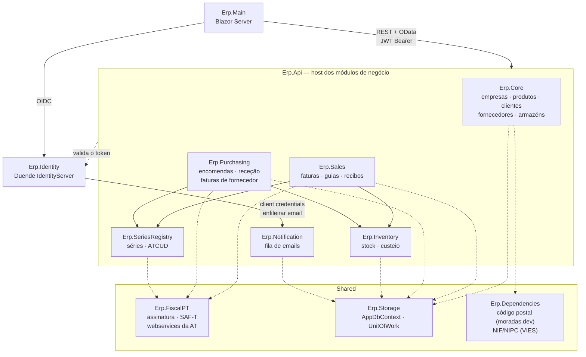
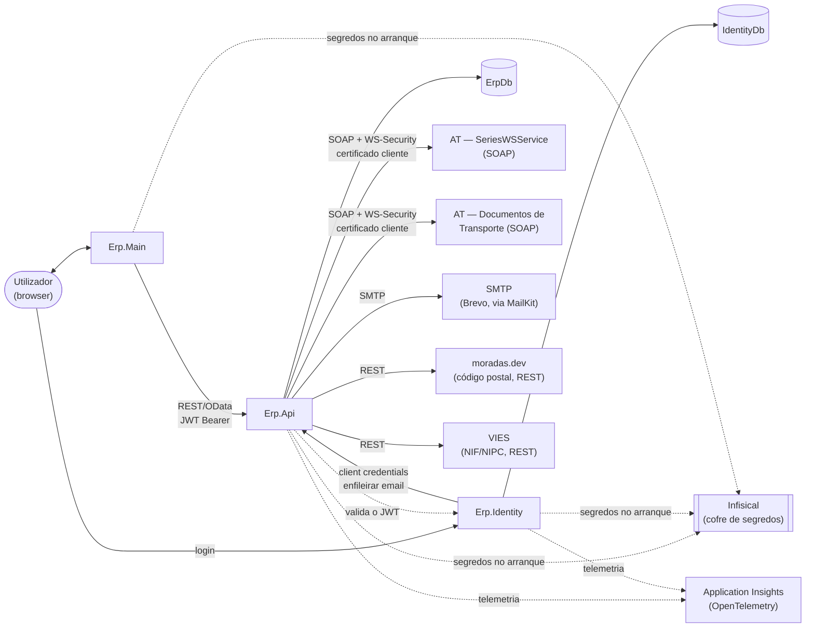

# ERP

ERP modular em .NET 10, com autenticação centralizada (Duende IdentityServer), interface web em Blazor com MudBlazor e um modelo multi-empresa (cada utilizador pode pertencer a várias empresas com papéis distintos).

**Monólito modular, não microserviços.** Os módulos de negócio — Core, SeriesRegistry, Sales, Inventory, Purchasing, Notification e os que vierem — mantêm projeto e camadas próprios, mas correm **num único host** (`Erp.Api`) e partilham uma base de dados e um `DbContext`. Separam-se em processos quando houver uma razão concreta para isso: escala independente, equipa dedicada ou cadência de deploy diferente. Até lá, a fronteira é o projeto, não o processo.

Correm em processo separado apenas os que têm razão para isso:

| Processo | Porquê |
|---|---|
| `Erp.Identity` | É um servidor OIDC — fronteira de segurança real |
| `Erp.Api` | Todos os módulos de negócio, incluindo o envio de email em segundo plano (ver [Notification](#notification)) |
| `Erp.Main` | Interface web |

## Índice

- [Stack](#stack)
- [Arquitetura](#arquitetura)
- [Mapa da solução](#mapa-da-solução)
- [Portas de desenvolvimento](#portas-de-desenvolvimento)
- [Autenticação e autorização](#autenticação-e-autorização)
- [Pré-requisitos](#pré-requisitos)
- [Como executar](#como-executar)
- [Base de dados](#base-de-dados)
- [Testes](#testes)
- [Integração contínua e deploy](#integração-contínua-e-deploy)
  - [Checklist para pôr um ambiente novo](#checklist-para-pôr-um-ambiente-novo-stagingprodução-a-funcionar)
- [Configuração e segredos](#configuração-e-segredos)
- [Endpoints da API](#endpoints-da-api)
  - [Core](#endpoints-do-módulo-core)
  - [Sales](#endpoints-do-módulo-sales)
  - [Inventory](#endpoints-do-módulo-inventory)
  - [Purchasing](#endpoints-do-módulo-purchasing)
- [API do Identity](#api-do-identity)
- [Interface (Erp.Main)](#interface-erpmain)
- [Documentação](#documentação)
- [Convenções de desenvolvimento](#convenções-de-desenvolvimento)
- [Estado atual e limitações conhecidas](#estado-atual-e-limitações-conhecidas)

---

## Stack

| Área | Tecnologia |
|---|---|
| Runtime | .NET 10 (`net10.0`) |
| UI | Blazor (Interactive Server) + MudBlazor 8 |
| Identidade | Duende IdentityServer 7 + ASP.NET Core Identity |
| APIs | ASP.NET Core Web API (Controllers) + OpenAPI/Scalar, com OData como linguagem de query das listagens |
| Dados | EF Core 10 + SQL Server (LocalDB em desenvolvimento) |
| Logging | Serilog |
| Testes | xUnit + FluentAssertions + NSubstitute |
| Análise estática | SonarAnalyzer.CSharp |

Solução: [Erp.slnx](Erp.slnx) (formato `.slnx`, requer Visual Studio 2022 17.13+ ou `dotnet` SDK recente).

---

## Arquitetura

Cada módulo de negócio é **um projeto**, com as camadas em pastas — repare que a colocação de interfaces e implementações é deliberada e difere da Clean Architecture "de manual":

| Pasta | Responsabilidade |
|---|---|
| **Domain** | Modelos e entidades |
| **Infrastructure** | Interfaces / abstrações (`IProductService`, `IStockStorage`, …) e DTOs |
| **Application** | Implementações dos serviços e casos de uso |
| **Storage** | EF Core: `DbContext`, migrations e repositórios |
| **Api / UI** | Apresentação e composição de DI, no host |

As pastas `Application` e `Storage` expõem cada uma um `DependencyInjection.cs` com um extension method (`AddCoreStorage`, `AddSalesApplication`, …) que o host compõe no `Program.cs`.

> **Camadas em pastas, não em projetos.** Cada módulo já foi quatro *assemblies* — `Domain`, `Infrastructure`, `Application`, `Storage`. Vinte projetos para cinco módulos custavam cinco `DependencyInjection.cs`, três cópias do `QualifiedTableName` e três `UnitOfWork` quase iguais, e o que impediam dentro de um módulo conseguia-se com pastas. **A fronteira que faz trabalho é o módulo, e essa continua a ser um projeto.** O Identity mantém a separação em projetos: é outro processo, com outra base de dados.

O preço a conhecer: o `Erp.Sales` referencia o `Erp.Inventory` inteiro, e já não apenas as suas interfaces. O compilador deixou de garantir que um módulo só toca no contrato do outro — passou a convenção, e o `IStockRecorder` continua a ser a forma certa de o fazer.



**Módulos → `Erp.FiscalPT`/`Erp.Storage`/`Erp.Dependencies` (tracejado)** é dependência de biblioteca partilhada, não chamada de rede — os três hosts continuam a correr como processos separados, ligados só pelas setas cheias (OIDC, REST/OData, client credentials).

`Erp.Dependencies` agrupa integrações públicas sem estado de negócio, reutilizáveis por qualquer módulo: `IPostalCodeLookupService` (moradas.dev, preenchimento automático de localidade a partir do código postal) e `IVatNumberValidationService` (validação estrutural do módulo 11 do NIF/NIPC, com consulta ao VIES para NIFs de empresa). O `Erp.Api` expõe-nas em `LookupsController` (`GET api/lookups/postal-codes/{postalCode}` e `GET api/lookups/vat-numbers/{nif}`), e o `Erp.Main` consome-as via `LookupApiClient` — usado em `PostalCodeField` (preenchimento da localidade) e em `PartnerFormFields`/`NewInvoice` (procura de NIF em clientes, fornecedores e faturação).

### Ligações em runtime

Para além da estrutura de código, isto é o que liga a instâncias reais fora do repositório — útil para perceber o que falha quando falta um secret ou um serviço externo está em baixo:



As credenciais para `SeriesWSService` e `Documentos de Transporte` são **por empresa** (`CompanyAtCredential`, ver [Configuração e segredos](#configuração-e-segredos)); o certificado cliente e a chave pública de cifra são partilhados pela instalação inteira.

`moradas.dev` e `VIES` são consultados sem credenciais (endpoints públicos) através dos serviços em `Erp.Dependencies` — o `Erp.Api` chama-os diretamente a pedido da UI, sem persistir os resultados; se um dos dois estiver em baixo, apenas a sugestão automática (localidade a partir do código postal, ou validação/nome a partir do NIF) fica indisponível, sem impedir a submissão manual do formulário.

---

## Mapa da solução

### UI

| Projeto | Descrição |
|---|---|
| [Erp.Main](src/UI/Erp.Main/) | Aplicação principal em Blazor Interactive Server. Autentica por OIDC contra o Identity, guarda tokens em cookie e injeta o access token nas chamadas às APIs via [UserAccessTokenHandler](src/UI/Erp.Main/Services/UserAccessTokenHandler.cs). |

### Identity

| Projeto | Descrição |
|---|---|
| [Erp.Identity](src/Identity/Erp.Identity/) | Host do IdentityServer + UI de conta e backoffice (componentes Blazor). |
| [Erp.Identity.Domain](src/Identity/Erp.Identity.Domain/) | Modelos e DTOs (`ClientEditItem`, `UserListItem`, `ApplicationUser`, …). |
| [Erp.Identity.Infrastructure](src/Identity/Erp.Identity.Infrastructure/) | Interfaces de serviços e de storage. |
| [Erp.Identity.Application](src/Identity/Erp.Identity.Application/) | Implementações: utilizadores, roles, clients, API scopes/resources, identity resources e providers. |
| [Erp.Identity.Storage](src/Identity/Erp.Identity.Storage/) | `ApplicationDbContext`, stores do IdentityServer, migrations e [SeedData](src/Identity/Erp.Identity.Storage/Data/SeedData.cs). |
| [Erp.Identity.Common](src/Identity/Erp.Identity.Common/) | Constantes do host de Identity: utilizador administrador semeado, ids e URLs de callback dos clients. |
| [Erp.Identity.Dependencies](src/Identity/Erp.Identity.Dependencies/) | Integrações externas — cliente HTTP para o serviço de notificações. |

### Erp.Api — o host dos módulos de negócio

[Erp.Api](src/Erp.Api/) serve todos os módulos, com os controllers organizados por módulo:

```
Controllers/Core/           Access, Companies, UserCompanies,
                            Products, ProductFamilies, ProductSubfamilies, Brands,
                            Customers, Suppliers, Warehouses
Controllers/SeriesRegistry/ Series
Controllers/FiscalPT/       Saft
Controllers/Sales/          Invoices, StockMovements, Payments, CustomerStatements
Controllers/Inventory/      Stock, InventoryCounts, InventoryFile
Controllers/Purchasing/     PurchaseOrders, GoodsReceipts, SupplierReturns, PurchaseInvoices,
                           SelfBilledInvoices, SupplierPayments, SupplierStatements
Controllers/Notification/   Notifications
Controllers/HealthController.cs
```

Um único audience (`erp-api`) e **dois scopes globais** (`erp.read` e `erp.write`), aplicados pelas políticas em [Policies](src/Erp.Api/Services/Policies.cs). Os módulos partilham o host e a base de dados; o que os separa é o projeto e o seu próprio `DbContext`.

Módulos ainda por implementar: Accounting e Reporting. Entram como mais uma pasta de controllers e um projeto em [src/Modules](src/Modules/).

| Módulo | Projeto | O que faz |
|---|---|---|
| Core | [Erp.Core](src/Modules/Erp.Core/) | Empresas, acessos e **dados mestre**: artigos com família, subfamília e marca, clientes, fornecedores e armazéns |
| SeriesRegistry | [Erp.SeriesRegistry](src/Modules/Erp.SeriesRegistry/) | O registo de séries: numeração sequencial sob bloqueio de linha e o código de validação da AT. Serve quem emitir documentos certificados, de qualquer módulo — e, ao lado, o contador dos números internos (`REC2026/7`), que não são fiscais mas também têm de correr em sequência |
| Sales | [Erp.Sales](src/Modules/Erp.Sales/) | Faturação certificada, guias de movimentação, recibos, notas de crédito e SAF-T |
| Inventory | [Erp.Inventory](src/Modules/Erp.Inventory/) | Existências por armazém, razão de movimentos, contagens e o ficheiro de inventário para a AT |
| Purchasing | [Erp.Purchasing](src/Modules/Erp.Purchasing/) | Encomendas, receção, devoluções, registo de faturas de fornecedor e **autofaturação** — o único documento certificado que emite |
| Notification | [Erp.Notification](src/Modules/Erp.Notification/) | Fila de emails, histórico e envio SMTP |

O `Erp.Sales` e o `Erp.Purchasing` referenciam o `Erp.Inventory`, para que emitir ou receber um documento e movimentar o stock caibam na mesma transação. O contrato é o [`IStockRecorder`](src/Modules/Erp.Inventory/Infrastructure/Application/IStockRecorder.cs), que não sabe de que módulo vem o documento — é isso que permitiu ao Purchasing reutilizá-lo sem tocar no Inventory, e é também o que faz o custeio funcionar sem que nenhum dos dois lados saiba dele: o Purchasing passa o custo da compra, o Sales não passa nada, e o razão trata do resto.

### Shared

| Projeto | Descrição |
|---|---|
| [Erp.Common](src/Shared/Erp.Common/) | Constantes que descrevem o contrato do access token — roles, claims, scopes e api resources — partilhadas pela `Erp.Api` e pelo `Erp.Main`, para não dependerem de um projeto do Identity. E o `IUnitOfWork`, que os serviços usam para gravar e abrir transações sem saberem que existe EF Core. |
| [Erp.Storage](src/Shared/Erp.Storage/) | O `AppDbContext` que todos os módulos de negócio partilham, as migrations e o `IModuleModelConfiguration` com que cada módulo declara as suas tabelas. Não referencia módulo nenhum. |
| [Erp.FiscalPT](src/Shared/Erp.FiscalPT/) | Primitivas de fiscalidade portuguesa: string e assinatura RSA dos documentos, ATCUD, número de documento, mensagem e imagem do código QR, arredondamento fiscal, os geradores e validadores do **SAF-T (PT)** e do **ficheiro de inventário** (com os XSD oficiais embebidos), e os clientes SOAP dos webservices da AT ([`AtWebservice/Series`](src/Shared/Erp.FiscalPT/AtWebservice/Series/), [`AtWebservice/TransportDocuments`](src/Shared/Erp.FiscalPT/AtWebservice/TransportDocuments/)) — esta última parte é que traz uma dependência real de infraestrutura (`HttpClient`), ao contrário do resto da biblioteca. |
| [Erp.Dependencies](src/Shared/Erp.Dependencies/) | Integrações públicas sem estado de negócio, reutilizáveis por qualquer módulo: `IPostalCodeLookupService` (código postal → localidade, via [moradas.dev](https://moradas.dev/)) e `IVatNumberValidationService` (validação estrutural do módulo 11 do NIF/NIPC, com consulta ao [VIES](https://ec.europa.eu/taxation_customs/vies/) para NIFs de empresa). Registada com `AddErpDependencies(configuration)`; os URLs base vêm de `Dependencies:PostalCodeBaseAddress`/`Dependencies:VatNumberValidationBaseAddress` em `appsettings.json`, com fallback para os endpoints públicos por omissão. |

### Notification

| Projeto | Descrição |
|---|---|
| [Erp.Notification](src/Modules/Erp.Notification/) | `EmailNotification` e estados, interfaces, fila de emails, histórico, envio SMTP e o `NotificationDbContext`. Inclui o `EmailQueueWorker`, um `BackgroundService` que drena a fila em intervalos fixos dentro do próprio `Erp.Api` — não há processo à parte, porque não há razão para escalar isto independentemente da API. |

### Testes

| Projeto | Descrição |
|---|---|
| [Erp.FiscalPT.Tests](tests/Erp.FiscalPT.Tests/) | Assinatura, ATCUD, código QR, arredondamento fiscal, e os ficheiros SAF-T e de inventário validados contra os XSD oficiais |
| [Erp.Sales.Tests](tests/Erp.Sales.Tests/) | Emissão, numeração de séries, documentos retificativos, faturação a partir de guias e anulação |
| [Erp.Core.Tests](tests/Erp.Core.Tests/) | Empresas, acessos, catálogo de artigos, clientes, fornecedores e armazéns, e o tratamento das claims JWT |
| [Erp.Inventory.Tests](tests/Erp.Inventory.Tests/) | Razão de stock, movimentação por documento, reversão na anulação, contagens, o ficheiro de inventário e o custeio médio ponderado — incluindo a armadilha clássica de anular uma compra barata quando o médio já subiu |
| [Erp.Purchasing.Tests](tests/Erp.Purchasing.Tests/) | Encomendas, receção, devoluções, faturas e notas de crédito de fornecedor: conferência a três, movimento de stock, anti-duplicação e anulação. E a autofaturação: numeração, cadeia de assinatura, aceitação, e o SAF-T `"S"` validado contra o esquema oficial |
| [Erp.SeriesRegistry.Tests](tests/Erp.SeriesRegistry.Tests/) | Criação de séries, o conjunto padrão de uma empresa nova, comunicação do código de validação, numeração, e o que uma série deixa (e não deixa) alterar |
| [Erp.IntegrationTests](tests/Erp.IntegrationTests/) | Contra um SQL Server a sério: numeração de séries e de documentos internos sob concorrência, saldos de stock, as regras de "não exceder o passo anterior", o índice anti-duplicação de faturas de fornecedor, atomicidade da transação que atravessa módulos, e o acordo entre o modelo e o esquema. Precisam de uma base de dados própria — ver [Testes](#testes) |
| [Erp.Identity.Tests](tests/Erp.Identity.Tests/) | Invariantes do seed (clients, scopes, resources), serviços e o cliente de email |
| [Erp.Notification.Tests](tests/Erp.Notification.Tests/) | Fila de emails, processamento e histórico |

---

## Portas de desenvolvimento

| Serviço | HTTPS | HTTP |
|---|---|---|
| Erp.Main | https://localhost:7019 | http://localhost:5191 |
| Erp.Identity | https://localhost:7081 | http://localhost:5269 |
| Erp.Api | https://localhost:7072 | http://localhost:5096 |

Estas portas estão referenciadas em configuração (URLs de callback OIDC, CORS, `Services:*` no [Erp.Main/appsettings.json](src/UI/Erp.Main/appsettings.json) e nos clients semeados). Alterar uma porta implica atualizar também esses pontos.

O `Erp.Api` expõe, em desenvolvimento, o documento **OpenAPI** em `/openapi/v1.json` e a referência interativa **Scalar** em `/scalar` (a raiz `/` redireciona para lá), e responde a `GET /health` sem autenticação através de um `HealthController`. O `Erp.Identity` expõe igualmente o OpenAPI (`/openapi/v1.json`) e o Scalar em `/scalar`, mas a raiz `/` continua a ser a página inicial da UI — o Scalar só se abre escrevendo `/scalar`.

---

## Autenticação e autorização

O `Erp.Identity` é o único emissor de tokens. O `Erp.Main` autentica por **Authorization Code + PKCE** com cookie de sessão (30 dias, sliding) e as APIs validam **JWT Bearer**, cada uma com a sua audience.

**Audiences**: `erp-api` para os módulos de negócio e `identity-api` para a API de utilizadores do Identity. O que separa o acesso entre módulos é o **scope**, não o audience.

**Scopes** (definidos em [Constants.cs](src/Shared/Erp.Common/Constants.cs)):

| Scope | Quem o recebe | Para quê |
|---|---|---|
| `erp.read` | `erp-portal` | Ler qualquer módulo da `erp-api` |
| `erp.write` | `erp-portal` | Escrever em qualquer módulo da `erp-api` |
| `erp.notification.send` | `erp-identity` | Identity → ERP API, para enfileirar email |
| `erp.identity.onboarding` | `erp-api` | ERP API → Identity, para convidar pessoas para uma empresa |
| `erp.identity.read` | `erp-portal` | Blazor → Identity API, para consultar utilizadores |

Como todos os módulos de negócio correm num só host, não há um par de scopes por módulo: o token diz apenas se a aplicação **lê** ou **escreve**, e o que o chamador alcança dentro da API é depois decidido por role e por pertença à empresa. Repare que `erp.notification.send` e `erp.identity.read` apontam em sentidos opostos e validam audiences diferentes: o primeiro é o Identity a chamar a `erp-api`, o segundo é a UI a chamar a `identity-api`.

**Políticas** ([Policies.cs](src/Erp.Api/Services/Policies.cs)):

| Política | Exige |
|---|---|
| `Read` | scope `erp.read` ou `erp.write` |
| `Write` | scope `erp.write` |
| `Admin` | role `SuperAdmin` |
| `NotificationSend` | scope `erp.notification.send` |

A `Admin` é a única que não olha para o scope: a administração do tenant depende de **quem é o utilizador**, não do que a aplicação pode fazer. O valor da constante é a própria role `SuperAdmin` e serve apenas de **nome da política** — não é um scope, não está semeado nem existe em token nenhum.

Em contrapartida, como o scope deixou de ser exigido, qualquer token que traga a role `SuperAdmin` satisfaz a `Admin`, mesmo tendo sido emitido só com `erp.read`. A contenção passa a assentar inteiramente no controlo de quem recebe a role.

Os scopes são lidos da claim `scope`, aceitando tanto a forma separada por espaços como claims repetidas.

**Pertença à empresa é validada por um filtro global, não por cada controller.** As políticas acima decidem *o que* um token pode fazer (ler, escrever, administrar) — nenhuma delas sabe *a que empresa*. Até este ponto, um `companyId` viajava em cada pedido como um valor qualquer (`?companyId=` ou `CompanyId` no corpo) e nenhum endpoint verificava se o utilizador pertencia mesmo a essa empresa: qualquer token com `erp.read`/`erp.write` conseguia ler ou escrever dados de **qualquer** empresa, bastava mudar o GUID. [`RequireCompanyAccessFilter`](src/Erp.Api/Services/Security/RequireCompanyAccessFilter.cs) fecha isto uma vez, para toda a API, em vez de cada um dos 24 controllers repetir a verificação: corre em todas as ações, encontra o `companyId` que a ação recebeu — parâmetro de rota, de query ou propriedade `CompanyId` do corpo — e recusa com 403 a menos que o chamador pertença a essa empresa ([`IUserCompanyService.CanAccessCompanyAsync`](src/Modules/Erp.Core/Infrastructure/Application/IUserCompanyService.cs), que já existia mas nunca era chamado) ou seja `SuperAdmin`. Um `companyId` vazio continua a ser rejeitado pela própria ação, como já era — o filtro só entra quando há um valor concreto para verificar. As poucas ações que legitimamente atravessam empresas (um chamador a perguntar pelo seu próprio acesso) ficam isentas com `[AllowAnyCompany]`, em vez de o filtro as ignorar silenciosamente.

**E também um filtro na base de dados, como segunda camada.** O filtro acima é a barreira correta — recusa o pedido antes de qualquer query correr, com um 403 explícito — mas depende de reconhecer o `companyId` na forma que a ação recebeu, e um novo endpoint, ou um serviço com um bug a consultar a empresa errada por dentro, podia continuar a passar-lhe ao lado. [`AppDbContext`](src/Shared/Erp.Storage/AppDbContext.cs) aplica um `HasQueryFilter` genérico a **toda** a entidade com uma coluna `Guid CompanyId` — encontrada por reflexão, já que `Erp.Storage` continua deliberadamente sem conhecer nenhum tipo de módulo nenhum — que só deixa passar uma linha cuja empresa esteja entre as do chamador atual. É isto que fecha também o IDOR das ações que só recebem um `{id:guid}` (por exemplo `GET /api/brands/{id}`): mesmo sem `companyId` nenhum para o filtro da API verificar, uma linha de outra empresa deixa de existir para a query, e o pedido responde 404 em vez de devolver os dados.

Quem o chamador é chega ao `AppDbContext` por [`ICurrentUserContext`](src/Shared/Erp.Storage/ICurrentUserContext.cs), resolvido uma vez por pedido por [`CurrentUserContextMiddleware`](src/Erp.Api/Services/Security/CurrentUserContextMiddleware.cs) — depois da autorização, para nunca gastar essa consulta num pedido que ia ser recusado de qualquer forma. Fora de um pedido HTTP real — migrações no arranque, o `Erp.IntegrationTests` a construir o `AppDbContext` diretamente, um futuro *worker* em background — o filtro fica sempre desligado por omissão ([`NullCurrentUserContext`](src/Shared/Erp.Storage/NullCurrentUserContext.cs), registado em `AddStorage`): nenhum desses é um chamador cujo acesso precise de ser policiado, e é assim que os testes de integração existentes continuam a passar sem qualquer alteração. A tabela de pertenças (`UserCompany`) fica de fora do filtro genérico ([`SkipTenantFilterAttribute`](src/Shared/Erp.Common/SkipTenantFilterAttribute.cs)) — filtrá-la também criaria um ciclo: a própria pergunta "a que empresas pertence este utilizador" deixaria de encontrar resposta, porque precisaria da resposta para se fazer a si própria. Uma verificação irmã no `SaveChanges` cobre a escrita: gravar uma linha para uma empresa fora das do chamador é recusado com uma exceção, antes de chegar à base de dados.

A prova de que isto funciona não está em ler o código — é o [`ICurrentUserContext`](src/Shared/Erp.Storage/ICurrentUserContext.cs) referenciado no filtro através de `this`, não de um valor capturado, precisamente para que o EF Core o volte a ligar à instância que está mesmo a correr a query, e não à que por acaso construiu o modelo (que o EF Core cria e guarda em cache uma única vez). [`TenantIsolationTests`](tests/Erp.IntegrationTests/TenantIsolationTests.cs) prova-o com dois `AppDbContext` reais, construídos a partir do mesmo modelo em cache, contra o LocalDB: um para cada empresa, cada um só a ver as suas próprias linhas — sem o qual ficaria só uma afirmação, não um facto verificado.

**Esse 404 ambíguo também está corrigido, sem tocar em cada módulo.** [`TenantAwareNotFoundFilter`](src/Erp.Api/Services/Security/TenantAwareNotFoundFilter.cs) corre depois da ação, só nos controllers marcados com `[ScopedEntity(typeof(...))]` — os 19 cujo `{id:guid}` não tem `companyId` nenhum para `RequireCompanyAccessFilter` verificar à partida: `BrandsController`, `CustomersController`, `EcoFeeTypesController`, `ProductFamiliesController`, `ProductSubfamiliesController`, `ProductsController`, `SuppliersController`, `WarehousesController`, `InventoryCountsController`, `GoodsReceiptsController`, `PurchaseInvoicesController`, `PurchaseOrdersController`, `SelfBilledInvoicesController`, `SupplierPaymentsController`, `SupplierReturnsController`, `InvoicesController`, `PaymentsController`, `StockMovementsController` e `SeriesController`. Quando a ação responde 404, o filtro pergunta a [`AppDbContext.ExistsForAnotherCompanyAsync`](src/Shared/Erp.Storage/AppDbContext.cs) — a única função autorizada a olhar para lá do filtro por empresa, e só para responder sim ou não, nunca para devolver a linha — se aquele id existe nalguma empresa. Se existir, o 404 vira 403: a linha não é de quem perguntou, não é que não exista. `[AllowAnyCompany]` e um `SuperAdmin` ficam de fora, pela mesma razão que já ficam de fora do `RequireCompanyAccessFilter`.

O código construído por reflexão (`Set<T>`, `IgnoreQueryFilters<T>`, `AnyAsync<T>`, cada um resolvido por `MakeGenericMethod`) é exatamente o tipo que compila sem avisos e só mostra o erro a correr: a primeira versão tinha um `AmbiguousMatchException` no `IgnoreQueryFilters` — duas sobrecargas, `GetMethod` sem desempate — que só apareceu quando [`TenantIsolationTests`](tests/Erp.IntegrationTests/TenantIsolationTests.cs) o correu contra o LocalDB a sério.

Ao mesmo tempo corrigiram-se dois problemas vizinhos que a mesma revisão expôs: `POST /api/access/check-role` respondia a qualquer token autenticado, mesmo sem `erp.read`, dizendo se um `UserId` arbitrário tinha um papel numa `CompanyId` arbitrária — passou a exigir `Admin`. E `GET /api/user-companies` (que lista pertenças) só exigia `Read`, apesar de o `POST`/`PUT`/`DELETE` já exigirem `Admin` havia muito — a UI que o chama (`/companies`) já só é visível a `SuperAdmin`, por isso a API passou a exigi-lo também, em vez de ser mais permissiva do que a própria interface que a usa.

**Clients semeados**:

| ClientId | Tipo | Finalidade |
|---|---|---|
| `erp-portal` | Code + PKCE | Erp.Main — autentica os utilizadores |
| `erp-api` | Client Credentials | O `Erp.Api` a chamar o Identity (convites de *onboarding*) |
| `erp-identity` | Client Credentials | O Identity a chamar o `Erp.Api` (enfileirar emails) |

**Roles**: apenas `SuperAdmin` e `User`. O `SuperAdmin` configura o tenant; todos os outros são `User`, e o que podem ver depende da empresa a que pertencem. O menu de Backoffice do `Erp.Main` e o backoffice do Identity só são visíveis a `SuperAdmin`, e os endpoints administrativos exigem a política `Admin`.

**Uma conta criada em `/Account/SignUp` não consegue iniciar sessão antes de confirmar o email.** `options.SignIn.RequireConfirmedAccount = true` ([`Erp.Identity.Storage/DependencyInjection.cs`](src/Identity/Erp.Identity.Storage/DependencyInjection.cs)) é o que o `Microsoft.AspNetCore.Identity` já sabe fazer sozinho: `SignInManager.PasswordSignInAsync` devolve `SignInResult.NotAllowed` para uma conta cujo `EmailConfirmed` continue `false`, sem precisar de nenhuma verificação manual em [`AuthenticationEndpoints`](src/Identity/Erp.Identity/Endpoints/AuthenticationEndpoints.cs). O registo gera o token com `GenerateEmailConfirmationTokenAsync`, envia-o por email (reaproveitando o [`IEmailService`](src/Identity/Erp.Identity.Infrastructure/Application/IEmailService.cs) que já existia para a recuperação de palavra-passe) e mostra `/Account/SignUpConfirmation` em vez de deixar entrar de imediato; `/Account/ConfirmEmail` é quem chama `ConfirmEmailAsync` e, a partir daí, a conta consegue autenticar-se. `/Account/ResendConfirmation` reenvia o link sem nunca revelar se a conta existe ou já está confirmada — a mesma cautela que `ForgotPassword` já seguia. **O utilizador semeado pelo `SeedData` já nasce com `EmailConfirmed = true`**, por isso não é afetado; qualquer conta que já existisse antes desta alteração, sem o ter confirmado, fica bloqueada até o fazer.

**O `returnUrl` de um pedido OIDC (`/connect/authorize/...`) sobrevive ao registo, não só ao login.** Antes, clicar em "Criar conta" a partir do ecrã de login — o caminho normal para alguém que chega vindo do `Erp.Main` — perdia a querystring logo no link, e o `SignUp.razor` nunca sequer a lia. Agora `ReturnUrl` viaja como parâmetro de query por todas as páginas da cadeia (`SignIn` ⇄ `SignUp` → `SignUpConfirmation` → link do email → `ConfirmEmail` → de volta a `SignIn`), através de [`ReturnUrlHelper.Sanitize`](src/Identity/Erp.Identity/Services/ReturnUrlHelper.cs) — um único sítio, partilhado com `AuthenticationEndpoints`, para aceitar só um caminho relativo ou um URL `http(s)` absoluto. A validação que decide mesmo se o redirecionamento é seguro continua a ser `IIdentityServerInteractionService.IsValidReturnUrl`, chamada só uma vez, no momento em que `/authentication/login` completa o fluxo — o resto é só o valor a não se perder pelo caminho.

**Cada início de sessão bem-sucedido ou falhado fica registado — no log estruturado e numa tabela própria.** `POST /authentication/login` regista sempre o resultado pelo `ILogger` estruturado do host — nunca o email ou a palavra-passe — com `userId` e `remoteIp` no sucesso, e `lockedOut`/`notAllowed` (conta por confirmar) na falha. Em paralelo, cada tentativa grava uma linha em [`LoginAudit`](src/Identity/Erp.Identity.Domain/Storage/LoginAudit.cs) (esta sim, com o email tentado — é o próprio propósito da página) através de [`ILoginAuditService`](src/Identity/Erp.Identity.Infrastructure/Application/ILoginAuditService.cs), visível no backoffice do Identity em **Logs de Sessão** — um link de topo, junto ao Início, não dentro do grupo Backoffice, só visível a `SuperAdmin`.

**Login com Google e Microsoft é opcional e é ao mesmo tempo registo.** `SignIn.razor` e `SignUp.razor` mostram os mesmos dois botões, ambos a apontar para `/authentication/{google,microsoft}-login` — não há um fluxo de registo externo separado do de login. A lógica de callback é partilhada (`HandleExternalLoginCallbackAsync` em [`AuthenticationEndpoints.cs`](src/Identity/Erp.Identity/Endpoints/AuthenticationEndpoints.cs)): se o email devolvido pelo provedor já corresponde a uma conta, associa o login externo a essa conta (`AspNetUserLogins`, já parte do `IdentityDbContext` por omissão, sem migration própria); se não corresponde a nenhuma, cria uma conta nova com o email já confirmado — o provedor já o verificou, ao contrário do `SignUp.razor` por password, que ainda passa por confirmação por email. Cada provedor só fica registado (`AddGoogle`/`AddMicrosoftAccount` em [`Program.cs`](src/Identity/Erp.Identity/Program.cs)) quando o respetivo `ClientId`/`ClientSecret` está configurado — ver [Configuração e segredos](#configuração-e-segredos). Uma conta criada assim não tem palavra-passe nenhuma (`PasswordHash` nulo); [`Profile.razor`](src/Identity/Erp.Identity/Pages/Profile/Profile.razor) distingue os dois casos com `UserManager.HasPasswordAsync` — mostra "Definir palavra-passe" (`AddPasswordAsync`, sem pedir a atual) em vez de "Alterar palavra-passe" (`ChangePasswordAsync`, que falharia sempre sem uma password para verificar).

**reCAPTCHA v3 protege o login e o registo, mas só depois de abusados.** As primeiras `Constants.Recaptcha.AttemptThreshold` (3, em [`Constants.cs`](src/Identity/Erp.Identity.Common/Constants/Constants.cs)) tentativas por IP passam sem qualquer desafio — nem o script chega a carregar. A partir daí, `SignIn.razor`/`SignUp.razor` carregam o reCAPTCHA v3 (invisível) e passam a exigir um token válido, verificado por [`IRecaptchaVerifier`](src/Identity/Erp.Identity.Infrastructure/Application/IRecaptchaVerifier.cs) contra o `siteverify` da Google (`success`, `score ≥ 0.5` e a `action` a bater certo com o pedido). A contagem é diferente em cada página, mas ambas persistidas na base de dados — não em memória, para o limiar se manter correto seja qual for a instância do `Erp.Identity` que atende o pedido: em `SignIn.razor` são logins **falhados** pelo mesmo IP nos últimos 15 minutos, lidos do `LoginAudit` (`ILoginAuditService.CountRecentFailuresAsync`) — o `POST /authentication/login` decide e verifica tudo outra vez do próprio servidor, nunca confiando no que a página decidiu mostrar; em `SignUp.razor` são submissões do formulário, sucesso ou falha, na nova tabela [`SignUpAttempts`](src/Identity/Erp.Identity.Domain/Storage/SignUpAttempt.cs) através de [`ISignUpAttemptTracker`](src/Identity/Erp.Identity.Infrastructure/Application/ISignUpAttemptTracker.cs) (sign-up não tem um equivalente a "password errada", daí contar submissões em vez de falhas). Sem `Recaptcha:SecretKey` configurada (ver [Configuração e segredos](#configuração-e-segredos)), nada disto é exigido, em ambiente nenhum.

Para que a autorização por role funcione são precisas **três** coisas, e falhando qualquer uma os endpoints com `[Authorize(Roles = ...)]` respondem **403 mesmo a um SuperAdmin**:

1. cada `ApiResource` declara `UserClaims = { "role" }` — sem isso o *access token* não leva roles nenhumas, mesmo que o utilizador as tenha;
2. cada API define `options.MapInboundClaims = false` — por omissão é `true` e o handler **renomeia** `role` para a URI WS-Federation `http://schemas.microsoft.com/ws/2008/06/identity/claims/role`;
3. cada API define `TokenValidationParameters.RoleClaimType = "role"` (e `NameClaimType = "name"`), porque é assim que o Duende emite as claims.

Os pontos 2 e 3 andam aos pares: definir o `RoleClaimType` sem desligar o mapeamento é **pior** do que não fazer nada, porque a claim passa a existir com o nome longo enquanto a autorização procura o curto. [JwtRoleClaimTests](tests/Erp.Core.Tests/JwtRoleClaimTests.cs) reproduz os dois cenários.

Depois de alterar isto é preciso reiniciar o Identity (para o seed atualizar os resources) **e voltar a autenticar**, porque o token em cache foi emitido antes. O endpoint `GET /api/access/me/claims` mostra o que a API vê no token e diz de imediato qual dos três pontos falhou.

O seed cria um utilizador administrador cujas credenciais vêm de `AdminUser:Email`/`AdminUser:Password` — ver [Configuração e segredos](#configuração-e-segredos) abaixo.

---

## Pré-requisitos

- [.NET SDK 10](https://dotnet.microsoft.com/download)
- SQL Server — LocalDB chega para desenvolvimento (`(localdb)\MSSQLLocalDB`)
- Certificado de desenvolvimento HTTPS: `dotnet dev-certs https --trust`

---

## Como executar

```powershell
# 1. Restaurar e compilar
dotnet restore Erp.slnx
dotnet build Erp.slnx

# 2. Arrancar os três processos (em terminais separados) — cada host aplica migrations e
#    semeia os dados críticos (clients, scopes, roles, admin) sozinho no arranque
dotnet run --project .\src\Identity\Erp.Identity\Erp.Identity.csproj --launch-profile https
dotnet run --project .\src\Erp.Api\Erp.Api.csproj --launch-profile https
dotnet run --project .\src\UI\Erp.Main\Erp.Main.csproj --launch-profile https
```

> A recuperação de password do Identity enfileira o email no `Erp.Api`, que também o envia — o `EmailQueueWorker` corre dentro do próprio `Erp.Api` (ver [Notification](#notification)). Sem `Smtp:*` configurado localmente a notificação fica `Failed`, mas o fluxo de reset em si (gerar o link, validar o token) não depende disso.

Abrir https://localhost:7019 — o acesso não autenticado é redirecionado para o login do Identity.

Em Visual Studio existe o perfil de arranque múltiplo **"All"** ([Erp.slnLaunch.user](Erp.slnLaunch.user)).

**Migrações e seed aplicam-se sozinhas.** O `Erp.Api` e o `Erp.Identity` fazem duas coisas no arranque: aplicam as migrations pendentes (nunca é destrutivo) e semeiam clients, scopes, resources, roles e admin user (crítico para a app funcionar) — [Program.cs](src/Erp.Api/Program.cs) e [SeedData](src/Identity/Erp.Identity.Storage/Data/SeedData.cs). É por isto que o *pipeline* de deploy (ver [Integração contínua e deploy](#integração-contínua-e-deploy)) não tem passos de migração nem seed: publicar código e arrancar a app já chega. **Nota:** o seed sobrescreve o que foi editado no backoffice (clients, scopes, resources) — alterações feitas lá são perdidas no arranque seguinte. Criar uma migração nova continua manual, com `dotnet ef migrations add` (ver [Base de dados](#base-de-dados)).

---

## Base de dados

| Base de dados | Connection string | Utilizada por |
|---|---|---|
| `ErpPortugal` | `ErpDb` | Todos os módulos de negócio e o worker |
| `ErpPortugal_Identity` | `IdentityDb` | Erp.Identity |

**Uma base de dados para o ERP**, com todas as tabelas em `dbo`. É o que permite que emitir uma fatura, dar saída de stock e gerar o lançamento contabilístico caibam numa transação — sem transações distribuídas nem sagas dentro de um único processo — e o que devolve as chaves estrangeiras entre módulos que a separação anterior impedia.

**Um `DbContext` para todos os módulos de negócio**: o [`AppDbContext`](src/Shared/Erp.Storage/AppDbContext.cs), com um só `__EFMigrationsHistory`. Ele **não conhece entidade nenhuma** — cada módulo declara as suas tabelas numa `IModuleModelConfiguration` no seu próprio projeto, para que a dependência continue a apontar dos módulos para o partilhado e acrescentar um módulo nunca implique editar código partilhado.

Foram cinco contextos, e a maquinaria que os cosia — uma ligação partilhada, uma transação ambiente e um *unit of work* por módulo — desapareceu com eles. Um `SaveChangesAsync` escreve agora tudo o que o pedido acumulou, venha de que módulo vier, e as chaves estrangeiras entre módulos são relações a sério. O plano e as decisões estão em [Um `DbContext` para os módulos de negócio](docs/single-dbcontext.md).

> **As transações explícitas continuam a ser precisas onde há bloqueios.** O `WITH (UPDLOCK, ROWLOCK)` só segura a linha até ao fim da transação; sem uma, o EF envolve cada `SaveChanges` na sua e o bloqueio da leitura é largado antes da escrita que depende dele. É por isso que a emissão de documentos, as notas de crédito, a faturação a partir de guias, o fecho de contagens, o acerto manual de existências e a receção, devolução e faturação de compras abrem uma.
>
> **E o saldo de stock leva `HOLDLOCK` além de `UPDLOCK`**, porque muitas vezes a linha ainda não existe: o primeiro movimento de um artigo é o que a cria. Um *update lock* não tem a que se agarrar quando nada corresponde, por isso vários primeiros movimentos leriam todos nulo, criariam todos um saldo, e todos menos um morreriam no índice único. O `HOLDLOCK` bloqueia o **intervalo** da chave, que é o que torna seguro "ler, e inserir se não estava lá".
>
> **Uma armadilha do EF Core que custou caro:** compor LINQ sobre um `FromSqlRaw` faz o EF envolver a instrução numa subconsulta e projetar as colunas ele próprio — e para uma *complex property* projeta os **nomes por omissão**, `ShipFrom_Address` em vez do `ShipFromAddress` que o mapeamento e a tabela usam. A consulta rebenta com *Invalid column name*, e só naquela entidade, porque a guia de movimentação é a única mapeada com `ComplexProperty`. Onde só se quer o bloqueio, usa-se `ExecuteSqlRawAsync` e não se materializa nada — que é mais honesto de qualquer forma: tomar um bloqueio não devia fingir ser uma consulta.

A base do **Identity** fica separada: é outro processo, com ciclo de vida próprio e os stores do Duende.

> Com tudo em `dbo`, os nomes das tabelas têm de carregar o módulo quando houver risco de colisão. `Products` é o catálogo partilhado do Core; um conceito próprio das compras seria `PurchaseItem` ou equivalente, não outro `Products`.

O Identity usa três contextos (ASP.NET Identity, Configuration Store e Persisted Grant Store) sobre a mesma base de dados, com as migrations no assembly `Erp.Identity.Storage`.

```powershell
# Nova migration dos módulos de negócio (o startup project é sempre o Erp.Api)
dotnet ef migrations add <Nome> --context AppDbContext `
  --project .\src\Shared\Erp.Storage\Erp.Storage.csproj `
  --startup-project .\src\Erp.Api\Erp.Api.csproj

# Nova migration no Identity (indicar o contexto e a pasta de saída)
dotnet ef migrations add <Nome> --context ApplicationDbContext `
  --output-dir Data\Migrations\Identity `
  --project .\src\Identity\Erp.Identity.Storage\Erp.Identity.Storage.csproj `
  --startup-project .\src\Identity\Erp.Identity\Erp.Identity.csproj
```

Contextos disponíveis no Identity: `ApplicationDbContext`, `ConfigurationDbContext`, `PersistedGrantDbContext`.

Criar uma migração continua a ser manual, com os comandos acima; **aplicá-la não é** — os dois hosts fazem-no sozinhos no arranque, em qualquer ambiente (ver [Como executar](#como-executar)).

---

## Testes

```powershell
dotnet test Erp.slnx --filter "Category!=E2E"
```

**980 testes em onze projetos**, em duas famílias com propósitos diferentes. Um décimo segundo projeto, `Erp.E2ETests`, guarda testes de browser à parte — não correm neste comando porque precisam dos hosts a correr localmente (ver [abaixo](#testes-end-to-end--playwright-contra-a-ui-real)).

### Testes de unidade — 980, sem base de dados

As camadas Application são testadas com storages substituídos (NSubstitute), a biblioteca fiscal é testada diretamente — incluindo a validação dos ficheiros SAF-T e de inventário contra os XSD oficiais — e o cliente de email, a obtenção de tokens do Identity e as integrações keyless em [`Erp.Dependencies`](tests/Erp.Dependencies.Tests/) (moradas.dev e VIES) com um `HttpMessageHandler` de teste que grava os pedidos e devolve respostas guionadas, sem rede nenhuma. O `NifValidator` (módulo 11) é testado à parte, por ser lógica pura sem HTTP. [`Erp.Api.Tests`](tests/Erp.Api.Tests/) testa o `RequireCompanyAccessFilter` isoladamente — um `ActionExecutingContext` construído à mão, sem host nenhum a correr — cobrindo o SuperAdmin a passar sem consultar a base, o `[AllowAnyCompany]` a saltar a verificação, e o `companyId` a ser encontrado tanto num parâmetro direto como numa propriedade `CompanyId` do corpo do pedido. Correm em segundos e não precisam de nada instalado.

### Testes de integração — 44, contra SQL Server

Existem para responder às três perguntas que um storage substituído **não consegue** responder:

- **O modelo concorda com o esquema?** Uma coluna que o modelo chama de uma maneira e a migração de outra compila, migra, e só falha na primeira consulta — com um erro que parece uma migração partida e não é.
- **Os bloqueios de linha serializam mesmo alguma coisa?** A numeração das séries, os números internos e os saldos de stock assentam inteiramente em `WITH (UPDLOCK, HOLDLOCK, ROWLOCK)`. Um substituto devolve a mesma linha aos dois chamadores e ambos passam, exista o bloqueio ou não.
- **O filtro por empresa do `AppDbContext` sobrevive a duas instâncias reais ao mesmo tempo?** É exatamente o que um storage substituído não tem forma de exercitar: o filtro é construído uma vez, quando o EF Core constrói e guarda o modelo em cache, e só uma base de dados real com dois `AppDbContext` genuínos, um por empresa, prova que continua a ver o chamador certo em cada um — ver [`TenantIsolationTests`](tests/Erp.IntegrationTests/TenantIsolationTests.cs) e a secção sobre isto em [Autenticação e autorização](#autenticação-e-autorização).

Não é teoria: até hoje apanharam **cinco bugs reais** que os testes de unidade davam por bons — o primeiro movimento de um artigo a rebentar sob concorrência, o acerto de existências sem transação nenhuma, o `Invalid column name 'ShipFrom_Address'` ao faturar a partir de guias, nove em cada dez receções simultâneas a falhar por colisão de número, e uma fatura com o mesmo artigo em duas linhas a morrer contra o índice único do saldo de stock: a segunda linha não encontrava o saldo que a primeira ainda não tinha gravado e começava outro. O mesmo padrão tinha apanhado antes o contador dos códigos do ficheiro mestre — ambas as leituras passaram a olhar primeiro para o que a transação já tem em mãos.

**Preparação, uma vez:**

```powershell
sqlcmd -S "(localdb)\MSSQLLocalDB" -Q "CREATE DATABASE [ErpIntegrationTests]"
```

Os testes **migram-na sozinhos** e **nunca a apagam** — poder abri-la depois de uma falha vale mais do que deixar o servidor arrumado. É descartável: apague-a e volte a criá-la quando quiser. Limpam-na no arranque, por isso cada execução começa do zero. Para apontar para outro servidor, defina `ERP_TEST_SQL` com a *connection string* completa.

**Correr só estes:**

```powershell
dotnet test Erp.slnx --filter "Category=Integration"
```

Cada teste cria **a sua própria empresa**. Quase tudo neste sistema tem âmbito de empresa, o que torna esse isolamento barato e verdadeiro, e evita esvaziar tabelas entre testes. O contentor de DI é construído com o mesmo `AddModules` que o `Program.cs` usa — um teste que montasse a sua própria versão estaria a testar a sua própria montagem, e continuaria a passar depois de a produção divergir.

**No CI**, correm à parte, numa job dedicada (`integration-tests` em [dotnet-ci.yml](.github/workflows/dotnet-ci.yml)) que só existe em `workflow_dispatch` — nunca em PR — e nunca contra a base de dados de staging ou produção: apontam para uma Azure SQL dedicada só a isto, porque a limpeza no arranque (`ClearAsync`, acima) apagaria os dados de um ambiente a sério. Como o *runner* não está na rede do Azure, a job abre uma regra de *firewall* só para o seu próprio IP, corre os testes, e fecha a regra no fim — mesmo que falhem. `deploy` só avança depois desta job passar, em staging e em produção. Detalhes e configuração de uma vez, fora da pipeline, nos comentários da própria job.

### Testes end-to-end — Playwright, contra a UI real

`tests/Erp.E2ETests` conduz um browser real (Chromium, via [Playwright](https://playwright.dev/dotnet/)) contra o `Erp.Main` e, através do redireccionamento de login, o `Erp.Identity` — nada de substitutos: valida que as páginas renderizam, redirecionam e submetem tal como um utilizador experiencia. Não corre no `dotnet test Erp.slnx` normal (precisa de hosts a correr e dos browsers do Playwright instalados) — localmente serve sobretudo para ver o teste a correr num browser real e confirmar que um fluxo faz sentido antes de o consolidar. Instruções completas em [tests/Erp.E2ETests/README.md](tests/Erp.E2ETests/README.md).

**No CI**, correm à parte do `dotnet test Erp.slnx`, numa job dedicada (`e2e-tests` em [dotnet-ci.yml](.github/workflows/dotnet-ci.yml)) que só existe por `workflow_dispatch`, depois de `deploy` ter posto o staging no ar — é o único ponto da pipeline que aponta a um browser real ao site já deployado, em vez de a um artefacto de build. Só corre para `staging`: os `RedirectUris` do client OIDC são registados manualmente por ambiente (fora desta pipeline), e a produção ainda não tem utilizador de teste próprio. Precisa de dois *secrets* — `E2E_STAGING_TEST_USER_EMAIL` e `E2E_STAGING_TEST_USER_PASSWORD` — com um utilizador real de staging; sem eles, o teste de login completo faz *skip* silencioso (ver [tests/Erp.E2ETests/README.md](tests/Erp.E2ETests/README.md)).

---

## Integração contínua e deploy

Tudo vive num workflow só, [dotnet-ci.yml](.github/workflows/dotnet-ci.yml), em quatro jobs. **Só há um gatilho automático**: `pull_request` para `main`, que corre o `build-and-test` a cada PR, para dar retorno rápido antes do *merge*. Um push direto a `main` não corre nada sozinho — nem testes, nem *build*, nem deploy. Tudo o resto é `workflow_dispatch`: alguém vai a `Actions` e pede explicitamente.

O deploy usar `workflow_dispatch` em vez de `environment: staging/production` com **Required reviewers** também tem uma razão de plano: esse mecanismo só existe, para repositórios privados, nos planos GitHub Pro/Team/Enterprise — no Free, a página de configuração do *environment* nem mostra essa opção. Sem ele, a autorização é mais simples: só corre quem pedir. Ver [Estado atual e limitações conhecidas](#estado-atual-e-limitações-conhecidas).

Staging e produção são **seis Web Apps distintas** no Azure (três por ambiente), não *slots* da mesma — o *deployment slot* exige tier Standard ou superior, e o objetivo aqui era o Free chegar. Cada uma tem o seu URL, o seu *publish profile* e as suas *Application settings*.

```
PR → main → build-and-test (automático, só isto)

Actions → Run workflow → escolher "staging" ou "production"
              → build-and-test → integration-tests → deploy → e2e-tests (só em staging)
              (sempre a pedido; production também exige que o branch seja main)
```

**`build-and-test`** compila a solução inteira e corre os testes com `--filter "Category!=Integration"` — os de integração ficam de fora porque precisam de SQL Server e correm à parte, na job seguinte (ver [Testes](#testes)). Publica o relatório e os `.trx` como artefactos, mesmo quando falha. Corre em todo o PR, e também como primeiro passo de um `workflow_dispatch`.

**`integration-tests`** só corre por `workflow_dispatch`, nunca em PR. Depende de `build-and-test` ter passado, abre uma regra de *firewall* na Azure SQL só para o IP do próprio *runner*, corre os 30 testes de integração contra uma base de dados dedicada — nunca a de staging/produção, ver [Testes](#testes) — e fecha a regra no fim, mesmo que os testes falhem. Detalhes de configuração nos comentários da própria job em [dotnet-ci.yml](.github/workflows/dotnet-ci.yml).

**`deploy`** só corre por `workflow_dispatch` — em `Actions → Build and Test ERP Solution → Run workflow`, escolhendo `staging` ou `production` num menu — nunca por push nem PR. Depende de `build-and-test` e `integration-tests` terem passado, e para cada uma das três apps (`api`, `identity`, `main`) faz `dotnet publish` e despacha com `azure/webapps-deploy@v3` para a Web App do ambiente escolhido, com o *publish profile* correspondente. `staging` aceita qualquer *branch* escolhido no próprio `workflow_dispatch`, para testar antes do *merge*; `production` só corre se esse *branch* for `main`. Compila de novo em cada corrida — ao contrário de um modelo com *promote*, aqui staging e produção não partilham o mesmo binário, porque são duas execuções manuais independentes, normalmente em momentos diferentes.

**`e2e-tests`** só corre depois de `deploy` ter tido sucesso **e** o ambiente escolhido ter sido `staging` — nunca em produção, nunca por push nem PR. Corre os testes de `tests/Erp.E2ETests` (ver [Testes](#testes)) num Chromium real contra o URL já deployado do `Erp.Main`/`Erp.Identity` de staging, incluindo o login completo com um utilizador de teste guardado em *secrets*. É o único ponto da pipeline a validar o site a sério, já no ar — tudo antes disto valida código ou artefactos de build.

### Configuração necessária, uma vez, fora da pipeline

**No GitHub** — nada a configurar em *environments* (sem Required reviewers no Free, a única coisa que um `environment:` faz aqui é agrupar o *run* na UI). Só falta:
- Seis *secrets* com os *publish profiles*, um por Web App — descarregados no Azure em **Overview → Get publish profile** de cada app (são ficheiros diferentes, mesmo com o mesmo código por trás):

  | App | Web App de staging | Secret | Web App de produção | Secret |
  |---|---|---|---|---|
  | Erp.Api | `erp-api-staging` | `AZURE_WEBAPP_PUBLISH_PROFILE_API` | `erp-api-prod` | `AZURE_WEBAPP_PUBLISH_PROFILE_API_PROD` |
  | Erp.Identity | `identity-staging` | `AZURE_WEBAPP_PUBLISH_PROFILE_IDENTITY` | `identity-prod` | `AZURE_WEBAPP_PUBLISH_PROFILE_IDENTITY_PROD` |
  | Erp.Main | `erp-staging` | `AZURE_WEBAPP_PUBLISH_PROFILE_MAIN` | `erp-prod` | `AZURE_WEBAPP_PUBLISH_PROFILE_MAIN_PROD` |

- Mais seis *secrets*, só para a job `integration-tests` — nenhum é um *publish profile*, e nenhum dá acesso a deploy nem às Web Apps:

  | Secret | O que é |
  |---|---|
  | `AZURE_SQL_TEST_CLIENT_ID` | Client ID do Azure AD App registado para esta job — só tem permissão de gerir *firewall rules* deste SQL Server, nada mais |
  | `AZURE_TENANT_ID` | Tenant do Azure AD |
  | `AZURE_SUBSCRIPTION_ID` | Subscrição onde está o SQL Server |
  | `AZURE_SQL_RESOURCE_GROUP` | Resource group do SQL Server |
  | `AZURE_SQL_SERVER_NAME` | Nome do servidor lógico (ex. `database-server-erp`) |
  | `INTEGRATION_TEST_SQL_CONNECTION` | *Connection string* completa da base de dados dedicada aos testes, com um login próprio (não o `sa-erp` da staging) |

  Um secret vazio ou mal escrito não dá erro óbvio: a linha `publish-profile:` desaparece do log do passo (input vazio não é impresso) e a *action* falha com *"No credentials found"*, como se faltasse um `azure/login` que nunca existiu neste workflow.

- Mais dois *secrets*, só para a job `e2e-tests` — as credenciais de um utilizador real de staging, para o teste de login completo (ver [Testes](#testes)):

  | Secret | O que é |
  |---|---|
  | `E2E_STAGING_TEST_USER_EMAIL` | Email de um utilizador que existe (ou é criado) no `Erp.Identity` de staging |
  | `E2E_STAGING_TEST_USER_PASSWORD` | Password desse utilizador |

  Sem estes dois, a job não falha — o teste de login faz *skip* silencioso, só o smoke test do redireccionamento para o login é que corre.

**No Azure** — isto é o que faz os `appsettings.Staging.json`/`appsettings.Production.json` (ver [Base de dados](#base-de-dados)) serem lidos de facto, e nada disto passa pela pipeline:
- Criar as 6 Web Apps (qualquer tier serve para as de staging, incluindo Free/F1).
- Em cada uma, definir a *Application setting* `ASPNETCORE_ENVIRONMENT` — `Staging` nas três de staging, `Production` nas três de produção. Sem *slot*, não há nada para marcar como *sticky*: é um recurso à parte, o valor fica só ali. É isto, e só isto, que decide qual `appsettings.*.json` a app lê no arranque: o `dotnet publish` leva sempre os quatro ficheiros (base + Development + Staging + Production, sem filtro nenhum no `.csproj`), e é a variável de ambiente do processo — não a pipeline — que escolhe qual se aplica por cima do base.

  Pelo **Portal**, repetir em cada uma das 6 Web Apps:
  1. Abrir a Web App em `portal.azure.com`.
  2. Menu lateral → **Settings → Environment variables** (portais mais recentes) ou **Configuration** (portais mais antigos) — é o mesmo separador, chamado **App settings**.
  3. **+ Add** / **New application setting**.
  4. **Name**: `ASPNETCORE_ENVIRONMENT` — **Value**: `Staging` ou `Production`, conforme a app.
  5. **Apply**/**OK**, depois **Save** no topo da página e confirmar em **Continue**.

  Ou via **CLI**, para as seis de uma vez:
  ```powershell
  az login
  $rg = "<resource-group>"
  foreach ($app in "erp-api-staging","identity-staging","erp-staging") {
    az webapp config appsettings set --resource-group $rg --name $app --settings ASPNETCORE_ENVIRONMENT=Staging
  }
  foreach ($app in "erp-api","identity","erp") {
    az webapp config appsettings set --resource-group $rg --name $app --settings ASPNETCORE_ENVIRONMENT=Production
  }
  ```

Os valores sensíveis (connection strings, segredos de cliente, password de SMTP) continuam fora do repositório — ver [Configuração e segredos](#configuração-e-segredos). Só as três variáveis de arranque do Infisical (`Infisical:ClientId`/`ClientSecret`/`ProjectId`) ficam como *Application settings* do Azure em cada Web App; todo o resto vem do próprio cofre.

### Checklist para pôr um ambiente novo (staging/produção) a funcionar

Fazer o deploy não chega para o login funcionar — três coisas têm de estar feitas:

1. **Fazer o deploy** — `Actions → Run workflow`, escolher `staging` ou `production` (ver acima).

2. **Preencher os `appsettings.{Ambiente}.json`** dos três hosts com os URLs reais desse ambiente — nunca ficam vazios nem apontam para `localhost` (ver [Configuração e segredos](#configuração-e-segredos) para saber quais chaves vivem em appsettings e quais vêm do cofre):

   | Host | Chaves a preencher em appsettings |
   |---|---|
   | Erp.Api | `IdentityServer:Authority`, `ErpApiClient:Authority`/`ClientId`, `AT:SeriesUrl`, `AT:TransportDocumentsUrl` |
   | Erp.Identity | `IdentityServer:Authority`, `ErpApi:BaseUrl`, `ErpIdentityClient:Authority`/`ClientId`/`Scope` |
   | Erp.Main | `OidcConfiguration:Authority`/`RedirectUri`/`PostLogoutRedirectUri`, `Services:Api`/`IdentityApi` |

   Todas apontam para o **URL real** da Web App de cada peça nesse ambiente (ex. `https://erp-api-staging.azurewebsites.net`), nunca para `localhost` nem para o URL de outro ambiente.

3. **Registar os segredos desse ambiente no cofre** (`ConnectionStrings:*`, `Smtp:*`, `AT:SigningKeyPem`, `ErpIdentityClient:ClientSecret`, `ErpApiClient:ClientSecret`, `AdminUser:*`) e as três variáveis de arranque do Infisical como *Application setting* nas Web Apps desse ambiente — ver [Configuração e segredos](#configuração-e-segredos).

4. **Registar esse mesmo URL do Erp.Main como cliente autorizado no Identity.** Este é o passo que falta hoje, e que faz o login falhar em staging mesmo com o passo 2 feito: o `RedirectUris`, `PostLogoutRedirectUris` e `AllowedCorsOrigins` do client `erp-portal` **não vêm de configuração** — estão fixos em código, em [`Constants.Clients`](src/Identity/Erp.Identity.Common/Constants/Constants.cs#L103-L111) (só `HttpsLocalhost7019`/`HttpLocalhost5191`) e usados em [`SeedData.cs`](src/Identity/Erp.Identity.Storage/Data/SeedData.cs#L160-L162). Como o seed corre em todo o arranque (ver [Como executar](#como-executar)), só esses dois `localhost` ficam autorizados em qualquer ambiente — o Duende recusa qualquer outro `redirect_uri` com *invalid_redirect_uri*, mesmo que o `appsettings.Staging.json` do Erp.Main já aponte para o URL certo. Para um ambiente novo funcionar, isto tem de mudar em código (acrescentar o URL desse ambiente à lista de `Constants.Clients`, ou tornar isto configurável por `appsettings` em vez de fixo) e o Identity tem de ser publicado de novo.

---

## Endpoints da API

Todos os módulos de negócio são servidos por um único host (`Erp.Api`) e um único audience (`erp-api`). A separação de acesso é feita por scope, não por resource — ver [Autenticação e autorização](#autenticação-e-autorização).

### Endpoints do módulo Core

**Uma empresa nova nasce com um armazém.** Criar uma empresa cria também o armazém `01` — *Armazém principal* — marcado como o predefinido e com a morada da própria empresa, gravado na mesma transação. Sem ele a gestão de stocks não arranca: um documento que movimenta existências precisa de um armazém, e uma empresa acabada de criar não tinha nenhum.

**Os códigos do ficheiro mestre são sequenciais** — 1, 2, 3 — para clientes, fornecedores, famílias, subfamílias e marcas. Não se escrevem no ecrã: o campo é só de leitura e o número sai de um contador com bloqueio de linha, o mesmo que numera as encomendas e as receções, por empresa e por tipo de ficha. Um código que **venha no pedido é respeitado** — é assim que uma importação traz os seus — e o contador salta o que já estiver ocupado. A composição é feita pelo host ([`MasterDataCodes`](src/Erp.Api/Services/MasterDataCodes.cs)), pela mesma razão que as séries de uma empresa nova: o catálogo não sabe o que é um contador.

**O NIF é opcional na ficha**, tanto no cliente como no fornecedor: uma ficha abre-se muitas vezes antes de se saber o número, e a API continua a exigir um, por isso vale o de consumidor final até alguém escrever o verdadeiro.

**O código postal segue o país.** Em Portugal só se aceita `XXXX-XXX`, com dígitos — o formato que o SAF-T e os *webservices* da AT esperam — e o ecrã escreve o hífen sozinho. Noutro país fica como for escrito. A regra vive em [`PostalCodes`](src/Shared/Erp.Common/PostalCodes.cs) e é aplicada nas fichas, na empresa e no cliente de cada fatura.

**Registo de uma empresa pelo próprio utilizador (*self-service*).** Registar-se no Identity deixa a conta **sem role nenhuma** e sem empresa — de propósito: uma conta que não pertence a nenhuma empresa ainda não é utilizador de nada. Ao entrar no `Erp.Main` nesse estado, o `MainLayout` reencaminha para `/get-started`, uma página com *layout* próprio (sem menu lateral, [`OnboardingLayout`](src/UI/Erp.Main/Layout/OnboardingLayout.razor)) que mostra os pacotes de subscrição ativos, pede os dados da empresa — com a mesma procura por NIF no VIES e por código postal das restantes fichas — e cria tudo numa transação: a empresa (com armazém, Ecovalor e séries, como qualquer outra), a subscrição no pacote escolhido e a associação do utilizador à empresa como `Owner`. Só **depois de a empresa existir** é que a conta recebe a role `User` do Identity, através do único endpoint em que alguém sem role pode mexer nas suas próprias — [`POST /api/self-service/complete-onboarding`](src/Identity/Erp.Identity/Controllers/SelfServiceController.cs), que apenas concede `User` e apenas a quem o token identifica. A página termina a forçar novo *login*: as *claims* de role são lidas uma vez, no início da sessão, por isso o *cookie* anterior continuaria a dizer que a conta não tem nenhuma. As duas bases de dados são distintas, por isso não há transação comum entre criar a empresa e conceder a role — se a segunda falhar, a empresa fica criada e o erro é mostrado, em vez de ser engolido.

**Configuração da empresa pelos próprios utilizadores.** Em *Configuração → Empresa* ([`CompanySettings`](src/UI/Erp.Main/Pages/Core/CompanySettings/CompanySettings.razor)) qualquer membro da empresa altera os dados da empresa, cria e edita **armazéns**, altera as credenciais **AT** (subutilizador WDT — só de escrita, a password nunca volta), vê as **subscrições** da empresa (em curso, agendadas e expiradas, com a opção de subscrever um pacote) e gere as **pessoas** da empresa. Não há papéis dentro da empresa: quem pertence a ela pode geri-la, e a API nunca deixa remover o último membro ativo.

**Adicionar pessoas por email, e convites (*onboarding*).** O `Erp.Api` é a autoridade sobre quem pode convidar quem; o Identity guarda e envia os convites. Ao adicionar um email ([`CompanyMembersController`](src/Erp.Api/Controllers/Core/CompanyMembersController.cs)) o `Erp.Api` pergunta ao Identity, em nome próprio (*client credentials*, client `erp-api`, scope `erp.identity.onboarding` — nenhum client de utilizador o tem), se o email já tem conta:

- **Já tem conta** — o Identity não cria nada (mas garante que a conta tem a role `User`) e o `Erp.Api` associa-a de imediato à empresa (reativa a associação se a pessoa tinha sido removida).
- **Não tem conta** — o Identity cria um pedido de *onboarding* (`OnboardingRequest`, `Pending`) e envia por email um convite com a ligação para `/Account/SignUp?email=…`. Convidar o mesmo email para a mesma empresa outra vez **reenvia** o pedido em vez de o duplicar. Os pedidos são visíveis no backoffice do Identity, em *Pedidos de Onboarding* (só SuperAdmin), onde também se podem cancelar.

Quando a pessoa se regista e confirma o email (ou entra com Google/Microsoft, que já vem confirmado), a primeira abertura do `Erp.Main` chama `POST /api/access/me/claim-invitations` ([`CompanyState`](src/UI/Erp.Main/Services/Core/CompanyState.cs)): o `Erp.Api` pede ao Identity os pedidos pendentes **desse** utilizador — só devolve algum se o email da conta estiver confirmado, para ninguém reclamar um convite com um endereço que não é seu —, cria as associações e marca os pedidos como `Completed` (o Identity concede então a role `User`). Como as *claims* de role só são lidas no início da sessão, o `MainLayout` força um novo *login* logo a seguir. Se o Identity não responder, a abertura da aplicação não falha: tenta-se de novo na sessão seguinte.

**Configuração dos clients de serviço.** O `Erp.Api` chama o Identity como o client `erp-api` (scope `erp.identity.onboarding`, fixo no código), configurado em `ErpApiClient:*` — `Authority` (o do Identity, que é também o host dos convites) e `ClientId` em `appsettings.*.json` do `Erp.Api`, e `ClientSecret` no cofre (`ERPAPICLIENT__CLIENTSECRET`). O Identity chama o `Erp.Api` como `erp-identity` (scope `erp.notification.send`), configurado em `ErpIdentityClient:*` (`ERPIDENTITYCLIENT__CLIENTSECRET`). São dois clients com dois secrets, um por direção, e nenhum tem valor por omissão no `Erp.Api`. Sem o secret do `erp-api`, adicionar por email falha com um erro claro (502) e a lista de convites pendentes aparece como indisponível — a lista de membros continua a funcionar. Depois de criar a base do Identity de raiz, é preciso definir os dois secrets no backoffice (ver [Configuração e segredos](#configuração-e-segredos)).

**Pacotes de subscrição.** Um [`SubscriptionPlan`](src/Modules/Erp.Core/Domain/SubscriptionPlan.cs) tem nome, descrição, preço e periodicidade (`Trial`, `Monthly`, `Annual`); um pacote de teste diz também quantos dias dura. A migração semeia três de partida — *Free* (30 dias), *Mensal* e *Anual* — **com preços que são apenas um ponto de partida**, para serem ajustados no backoffice. Cada empresa tem no máximo uma [`CompanySubscription`](src/Modules/Erp.Core/Domain/CompanySubscription.cs): mudar de pacote reescreve-a, e a validade é calculada a partir do próprio pacote (dias do teste, um mês, um ano) ou escrita à mão por um SuperAdmin. **Não há gateway de pagamentos**: comprar um pacote é registado, não cobrado. Estar expirada **nunca bloqueia nada** — o `MainLayout` mostra um aviso dispensável e a aplicação continua a funcionar. O backoffice tem CRUD dos pacotes (`/subscription-plans`) e a lista de que empresa está em que pacote, com a ação de mudar (`/subscriptions`), ambos só para SuperAdmin.

**Ecovalor — taxas de gestão de resíduos (baterias, óleos, etc.).** Desde 2020 a lei (DL 152-D/2017) exige que estas taxas apareçam **numa linha própria do documento**, nunca embutidas no preço do artigo, com IVA à taxa normal acrescido por cima. Um artigo aponta para um [`EcoFeeType`](src/Modules/Erp.Core/Domain/EcoFeeType.cs) — código, cálculo por unidade ou por quilograma, valor e entidade gestora — e criar o tipo cria automaticamente o pseudo-artigo (`ProductType = "I"`, taxas e encargos no SAF-T) em que a taxa é faturada. Ao adicionar à fatura ou à guia um artigo com Ecovalor associado, a UI gera de imediato a linha da taxa a seguir à do artigo, com a mesma quantidade; essa linha é uma linha normal para efeitos de totais, IVA, impressão e SAF-T, mas fica marcada (`IsEcoFee`) para nunca movimentar stock — uma taxa não é um artigo em armazém. **Toda a empresa nova nasce já com dois Ecovalor** (baterias, óleos), com valores de partida que têm de ser confirmados/ajustados à tabela oficial em vigor.

| Método | Rota | Autorização |
|---|---|---|
| `GET` | `/api/companies` | `Read` |
| `GET` | `/api/companies/{id}` | `Read` |
| `POST` | `/api/companies` | `Admin` |
| `PUT` | `/api/companies/{id}` | `Admin` |
| `GET` | `/api/user-companies?companyId=` | `Read` |
| `GET` | `/api/user-companies/{id}` | `Read` |
| `POST` | `/api/user-companies` | `Admin` |
| `PUT` | `/api/user-companies/{id}` | `Admin` |
| `DELETE` | `/api/user-companies/{id}` | `Admin` |
| `GET` | `/api/products?companyId=` · `/api/products/{id}` | `Read` |
| `POST` `PUT` | `/api/products` · `/api/products/{id}` | `Write` |
| `GET` `POST` `PUT` | `/api/product-families` | `Read` / `Write` |
| `GET` `POST` `PUT` | `/api/product-subfamilies?companyId=&familyId=` | `Read` / `Write` |
| `GET` `POST` `PUT` | `/api/brands` | `Read` / `Write` |
| `GET` `POST` `PUT` | `/api/customers` | `Read` / `Write` |
| `GET` `POST` `PUT` | `/api/suppliers` | `Read` / `Write` |
| `GET` `POST` `PUT` | `/api/warehouses?companyId=` | `Read` / `Write` |
| `GET` | `/api/vat-rates` · `/api/vat-rates/odata` | `Read` |
| `GET` | `/api/vat-rates/exemption-reasons` | `Read` |
| `PUT` | `/api/vat-rates/{id}` | `Admin` |
| `GET` `POST` `PUT` | `/api/eco-fee-types` | `Read` / `Write` |
| `GET` | `/api/lookups/postal-codes/{postalCode}` | `Read` |
| `GET` | `/api/lookups/vat-numbers/{nif}` | `Read` |
| `GET` | `/api/subscription-plans?activeOnly=` · `/api/subscription-plans/odata` · `/api/subscription-plans/{id}` | `Read` |
| `POST` `PUT` | `/api/subscription-plans` · `/api/subscription-plans/{id}` | `Admin` |
| `GET` | `/api/company-subscriptions/odata` · `/api/company-subscriptions/{companyId}` | `Read` |
| `PUT` | `/api/company-subscriptions/{companyId}` | `Admin` |
| `GET` | `/api/companies/self-service/status` | Autenticado |
| `POST` | `/api/companies/self-service` | Autenticado |
| `GET` | `/api/companies/{companyId}/members` | `Read` (membro da empresa) |
| `POST` | `/api/companies/{companyId}/members` | `Write` (membro da empresa) |
| `DELETE` | `/api/companies/{companyId}/members/{membershipId}` · `/api/companies/{companyId}/members/invitations/{invitationId}` | `Write` (membro da empresa) |
| `GET` `PUT` | `/api/companies/{id}/at-credentials` | `Read` / `Write` (SuperAdmin ou membro da empresa) |
| `GET` | `/api/access/me/companies` | Autenticado |
| `POST` | `/api/access/me/claim-invitations` | Autenticado |
| `GET` | `/api/access/me/companies/{companyId}/role` | Autenticado |
| `POST` | `/api/access/check-role` | Autenticado |

---

### Endpoints do módulo Sales

Além da faturação, o módulo emite os **documentos de movimentação de mercadorias** — guias de remessa (`GR`), transporte (`GT`), ativos próprios (`GA`), consignação (`GC`) e devolução (`GD`), exportados no SAF-T em `MovementOfGoods`. Seguem exatamente as mesmas regras dos documentos de faturação: numeração sequencial por série, cadeia de assinatura, ATCUD, código QR e imutabilidade. Acrescentam o que o regime de bens em circulação exige: locais de carga e descarga, início do transporte, matrícula do veículo, e o **código que a AT devolve na comunicação prévia** — sem o qual a mercadoria não pode circular.

A fatura leva o que a lei e a cobrança pedem, e que não estava lá: **descontos de linha**, **data de vencimento** e a **morada completa do cliente**. O desconto é uma percentagem por linha, calculada sobre o valor ilíquido já arredondado, e o rodapé do documento diz *Total ilíquido*, *Total descontos*, *Total líquido*, *Total taxas* e *Total*, com o IVA aberto por taxa. No SAF-T o desconto viaja em `SettlementAmount` e o `UnitPrice` exportado já vem líquido dele, para que quantidade × preço dê o valor tributável. O vencimento nunca é anterior à data do documento, não é assinado e não vai no SAF-T: serve a cobrança e a conta corrente.

As **guias levam o mesmo desconto de linha** que a fatura, e o mesmo rodapé — ilíquido, descontos, líquido, taxas e total, com o IVA aberto por taxa. A aritmética é a mesma e o desconto viaja no SAF-T da mesma maneira, em `SettlementAmount` com o preço unitário já líquido.

A **fatura-recibo (`FR`) é paga na emissão**, por isso pede os meios de pagamento como um recibo: têm de somar exatamente o total, e nenhum outro tipo os aceita. Saem no SAF-T em `DocumentTotals/Payment` e no documento impresso. O seu vencimento é o próprio dia.

Uma **linha isenta cita a tabela da AT**. O código de isenção (`M01` a `M99`) passou a ser obrigatório em vez de um texto livre, e a menção legal — o que o SAF-T pede em `TaxExemptionReason` — vem da própria tabela quando não for escrita. A lista vive em [`TaxExemptionReasons`](src/Shared/Erp.FiscalPT/Documents/TaxExemptionReasons.cs), no `Erp.FiscalPT`, inclui os códigos acrescentados desde 2023 (`M44`, `M45`, `M46`) e é servida em `GET /api/vat-rates/exemption-reasons`. Vale para as faturas, as guias e a autofaturação, e há um teste que confirma que nenhuma menção passa os 60 caracteres que o esquema aceita. **A ficha do artigo guarda o seu motivo** quando é isento, e a linha que o usa já vem preenchida: escreve-se uma vez, não em cada documento.

As **notas de crédito e de débito** identificam o documento que corrigem e o motivo, como exige o artigo 36.º n.º 5 do CIVA. A regra vale nos dois sentidos: uma `NC` ou `ND` sem referência é recusada, e uma `FT`, `FS` ou `FR` com referência também. O documento corrigido tem de ser da mesma empresa, não estar anulado e não ser ele próprio retificativo; o seu número é copiado para o documento novo e sai no SAF-T em `References/Reference` e `Reason` de cada linha, além de constar do documento impresso. **Um documento não pode ser creditado além do seu valor**: as notas de crédito já emitidas contra ele contam para esse tecto e as anuladas não, enquanto as notas de débito não são limitadas, porque acrescentam ao que é devido em vez de retirarem. A linha do documento a creditar é bloqueada antes de se ler o já creditado, para que duas notas emitidas ao mesmo tempo por séries diferentes não passem ambas. Emitem-se em `/credit-notes/new`, partindo da fatura: escolhe-se primeiro o **cliente** e só depois o documento dele a corrigir — as linhas vêm dela, com os descontos que tinha, e credita-se tudo ou ajustam-se as quantidades.

O **documento impresso** tem página própria para cada família (`/invoices/{id}/print` e as equivalentes das guias e dos recibos), em HTML dimensionado para A4 e com um layout sem menu nem barra. As menções que a lei exige vivem em componentes partilhados em vez de copiadas por página: o cabeçalho com o emitente completo e a designação por extenso, e o rodapé com os 4 caracteres do hash seguidos de *Processado por programa certificado n.º XXXX/AT*, o ATCUD e o código QR — este renderizado pelo `QrCodeImage` do `Erp.FiscalPT`, que usa o renderizador de bytes do QRCoder e por isso não depende de nenhuma biblioteca de desenho. O número do certificado é lido do campo `R` do próprio QR, não da configuração atual: um documento emitido antes de o certificado mudar continua a imprimir o número com que foi emitido.

As **guias dão origem a faturas** sem se copiar nada à mão. Em `/invoices/from-movements` escolhe-se o cliente e aparecem as linhas de guia por faturar, agrupadas por documento: fatura-se tudo ou ajustam-se as quantidades, e várias guias entram numa só fatura. Uma guia pode ser faturada em várias vezes, **mas nunca por mais do que moveu** — o que já foi faturado é derivado das linhas de fatura que a referenciam, e as guias envolvidas são bloqueadas antes dessa leitura, pela mesma razão que nas notas de crédito. As guias de ativos próprios (`GA`) e de devolução (`GD`) nunca são faturadas. Cada linha guarda o número e a data da guia, que saem no SAF-T em `OrderReferences`.

A **exportação do SAF-T (PT) 1.04_01** vive em [`Erp.FiscalPT/Saft`](src/Shared/Erp.FiscalPT/Saft/), que é a biblioteca fiscal partilhada: recebe um `SaftAuditFile` e escreve o XML, sem saber nada de EF Core nem do módulo de vendas. O ficheiro é da **entidade tributável**, não de um módulo, e é por isso que o `SaftExporter` vive ali também — não lê nada, recebe as fontes de documentos, a entidade e o produtor, e o controller junta-lhe a empresa, que pertence ao Core. No `Erp.Sales` fica apenas o `SaftSummaryService`, que diz o que o módulo emitiu no período. Os *master files* (`Customer`, `Product`, `TaxTable`) são derivados dos próprios documentos — cada um traz o snapshot do cliente, dos artigos e das taxas — por isso o ficheiro é coerente consigo mesmo mesmo que as fichas tenham mudado entretanto. Os totais de controlo são calculados pelo escritor, nunca recebidos de fora, e os documentos anulados vão no ficheiro com estado `A` mas fora dos totais. A exportação faz-se em `/saft`, por mês, trimestre, ano ou intervalo livre.

A exportação **compõe-se a partir dos módulos**: cada um implementa [`ISaftDocumentSource`](src/Shared/Erp.FiscalPT/Saft/ISaftDocumentSource.cs) e declara para que **tipo de ficheiro** tem documentos, e o `SaftFileAssembler` junta o que deram, desduplicando os *master files* por chave. O `TaxAccountingBasis` vive no cabeçalho e não no escritor, porque `"F"` (faturação) e `"S"` (autofaturação) são ficheiros diferentes, não variantes do mesmo.

O **ficheiro de autofaturação** sai por isso do mesmo exportador, em `/saft` ou em `GET /api/saft/self-billing`, e é onde a distinção se torna concreta: é **um ficheiro por fornecedor**, com o NIF *dele* no cabeçalho, porque os documentos nele são vendas dele que nós emitimos em seu nome. A tabela `Customer` leva um único registo — **nós**, com `SelfBillingIndicator = 1` — o que se lê ao contrário até se olhar do lado certo: numa venda do fornecedor, o cliente somos nós. Nenhum destes documentos entra no ficheiro `"F"`, e há um teste que confirma exatamente isso.

O [esquema oficial da AT](src/Shared/Erp.FiscalPT/Saft/Schemas/SAFTPT1.04_01.xsd) está no repositório e vai embebido no assembly, e **cada exportação é validada contra ele** antes de o ficheiro ser entregue: os erros vão para o log e a contagem viaja no cabeçalho `X-Saft-Validation-Errors`, que a página mostra. Como o esquema publicado é XSD 1.1 e o .NET só implementa 1.0, as 19 regras `xs:assert` (co-ocorrência, como exigir motivo de isenção quando o imposto é zero) não são verificadas — passar aqui é necessário, não suficiente.

Emite também os **recibos** — `RC` (regime de IVA de caixa) e `RG` (restantes), exportados no SAF-T em `Payments`. Um recibo é um documento fiscalmente relevante como qualquer outro: numerado por série, assinado na mesma cadeia e imutável. As suas linhas dizem **que faturas liquida e por que valor**, e o serviço recusa liquidar mais do que a fatura ainda deve, liquidar uma fatura anulada, ou repetir a mesma fatura no mesmo recibo. Os meios de pagamento (`NU`, `CH`, `CD`, `CC`, `TB`, ...) têm de somar exatamente o total do recibo. Fora do regime de IVA de caixa o `TaxPayable` é zero: o IVA já foi apurado na fatura, o recibo só movimenta dinheiro. Anular um recibo não altera o registo original — escreve uma mudança de estado, e as faturas voltam a ficar em dívida.

| Método | Rota | Autorização |
|---|---|---|
| `GET` | `/api/invoices?companyId=` | `Read` |
| `GET` | `/api/invoices/{id}` | `Read` |
| `POST` | `/api/invoices` | `Write` |
| `POST` | `/api/invoices/{id}/void` | `Write` |
| `GET` | `/api/stock-movements?companyId=` | `Read` |
| `GET` | `/api/stock-movements/{id}` | `Read` |
| `POST` | `/api/stock-movements` | `Write` |
| `POST` | `/api/stock-movements/{id}/communicate` | `Write` |
| `POST` | `/api/stock-movements/{id}/void` | `Write` |
| `GET` | `/api/payments?companyId=` | `Read` |
| `GET` | `/api/payments/outstanding-invoices?companyId=&customerTaxId=` | `Read` |
| `GET` | `/api/payments/{id}` | `Read` |
| `POST` | `/api/payments` | `Write` |
| `POST` | `/api/payments/{id}/void` | `Write` |
| `GET` | `/api/saft/summary?companyId=&startDate=&endDate=` | `Read` |
| `GET` | `/api/saft?companyId=&startDate=&endDate=` | `Read` |
| `GET` | `/api/saft/self-billing?companyId=&supplierId=&startDate=&endDate=` | `Read` |
| `GET` | `/api/series?companyId=` | `Read` |
| `GET` | `/api/series/{id}` | `Read` |
| `POST` | `/api/series` | `Admin` |
| `PUT` | `/api/series/{id}` | `Admin` |
| `POST` | `/api/series/{id}/communicate` | `Admin` |
| `POST` | `/api/series/{id}/communicate-manually` | `Admin` |
| `POST` | `/api/series/{id}/cancel` | `Admin` |
| `POST` | `/api/series/{id}/finalize` | `Admin` |

O acesso é por **scope** do token (políticas em [Policies.cs](src/Erp.Api/Services/Policies.cs)); a gestão de séries não depende do scope mas sim da role `SuperAdmin`, através da política `Admin`. Não existe endpoint de alteração nem de remoção de documentos: correções fazem-se por documento retificativo e a anulação escreve um registo de mudança de estado.

**Uma empresa nova nasce com as suas séries.** Criar uma empresa cria também uma série por tipo de documento — as doze que existem, de `FT` a `RG` — codificadas `{Tipo}{Ano}` (`FT2026`, `NC2026`, `GR2026`…) e já com o efeito no stock habitual do tipo. Sem isto a empresa chegava incapaz de emitir seja o que fosse, e chegar lá dava doze passagens por um formulário para responder sempre o óbvio. Não as torna utilizáveis: falta o código de validação da AT, e esse ninguém o pode dar em nome da empresa. A composição é feita pelo host — uma empresa não sabe o que é uma série, e o registo de séries não sabe o que é uma empresa.

**Uma série quase não se altera.** O tipo, o identificador, a numeração inicial e a marca de autofaturação foram comunicados à AT e estão escritos em todos os documentos já emitidos: mudá-los deixaria o registo em desacordo com os documentos. O que resta é o **efeito no stock**, que diz o que os *próximos* documentos da série fazem ao armazém — uma decisão de negócio, não fiscal, e que negócios diferentes tomam de forma diferente para o mesmo tipo de documento. É esse, e só esse, que o `PUT /api/series/{id}` aceita.

---

### Endpoints do módulo Inventory

O stock é gerido **ao nível do armazém** — uma empresa pode ter vários — e o registo é um **razão só de acrescentos**: nada se apaga nem se reescreve, e o saldo é uma projeção que se pode sempre reconstruir a partir dos movimentos. É isso que o teste de stock faz, comparando o saldo guardado com o razão recalculado; uma diferença significa que alguém escreveu fora do caminho normal.

O stock é **valorizado ao custo médio ponderado**, e a regra cabe numa frase: *um movimento que traz o seu custo move valor a esse custo; um que não traz, move ao médio*. Uma compra traz, uma venda não. Cada movimento fica **carimbado com o custo a que moveu valor**, o que torna o razão auto-explicativo e faz com que anular uma compra desfaça exatamente o que ela fez — em vez de a desfazer ao que o stock vale hoje, que é onde o método clássico se desvia. A aritmética vive num sítio só, [`WeightedAverageCost`](src/Modules/Erp.Inventory/Domain/WeightedAverageCost.cs), partilhada entre o saldo corrente e o [recálculo do razão](src/Modules/Erp.Inventory/Domain/StockValuation.cs): o primeiro responde a *quanto vale isto agora*, o segundo a *quanto valia no fim de março* — que é o que o ficheiro de inventário precisa e nenhum valor guardado lhe pode dar. O teste de stock confere um contra o outro, e conta as diferenças de quantidade e de valor em separado, porque falham por motivos diferentes.

O **custo de abertura** entra por duas portas, ambas para quem começa a usar o sistema com o armazém já cheio: o acerto de existências e a linha acrescentada a uma contagem, que podem declarar um custo unitário. Uma contagem normal não traz custo — encontra mercadoria, não preços — e o que aparece vale o médio do que já lá estava.

Quem movimenta são os **documentos**: cada série declara o que faz ao stock (entrada, saída ou nada), e o movimento é gravado na mesma transação que o documento. Nos **documentos integradores** a regra é que ninguém movimenta duas vezes: se a guia de remessa já deu saída, a fatura que a consome não volta a dar. Anular um documento devolve o stock — por lançamento oposto, nunca por remoção, e uma segunda anulação não faz nada.

As **contagens** são totais ou parciais, e a zeragem não é um mecanismo à parte: é uma contagem aberta com todas as linhas a zero, cujo fecho esvazia o stock em âmbito. Só pode haver uma contagem aberta por empresa. O fecho mede contra o saldo do momento e não contra a fotografia da abertura, para que movimentos feitos durante a contagem não sejam desfeitos.

Uma contagem **abre mesmo sem existências nenhumas**, e a folha **cresce**: acrescenta-se um artigo que estava na prateleira e o sistema desconhecia, com o custo a que entrou. Sem isto o stock de abertura não teria por onde entrar — a contagem é a forma natural de o registar, e exigir stock para abrir uma contagem trancava a única porta pelo lado de dentro. Uma linha acrescentada abre a zero, por isso o que se contar é exatamente o que dá entrada.

O **ficheiro de inventário** gera-se nas duas versões oficiais — `Stock_1_2.xsd` (`urn:StockFile:PT_1_02`, só quantidades) e `Inventario_2_01.xsd` (`urn:StockFile:PT_2_01`, valorizado, obrigatório desde 2021) — porque o inventário tanto pode ser comunicado valorizado como não. Ambos os XSD estão embebidos e **cada ficheiro é validado antes de ser entregue**. As quantidades **e os valores** vêm do razão **à data de referência**, e não dos saldos de hoje, que dariam a posição errada para qualquer período já fechado. A `ProductCategory` vem do campo `InventoryCategory` da ficha — que não é o `ProductType` do SAF-T: as letras coincidem mas os vocabulários não.

| Método | Rota | Autorização |
|---|---|---|
| `GET` | `/api/stock?companyId=&warehouseId=&productCode=` | `Read` |
| `GET` | `/api/stock/ledger?companyId=&warehouseId=&productCode=` | `Read` |
| `GET` | `/api/stock/check?companyId=&productCode=` | `Read` |
| `POST` | `/api/stock/adjustments` | `Write` |
| `GET` | `/api/inventory-counts?companyId=` · `/api/inventory-counts/{id}` | `Read` |
| `POST` | `/api/inventory-counts` | `Write` |
| `POST` | `/api/inventory-counts/{id}/lines` | `Write` |
| `PUT` | `/api/inventory-counts/{id}/lines` | `Write` |
| `POST` | `/api/inventory-counts/{id}/close` | `Write` |
| `GET` | `/api/inventory-file/summary?companyId=&fiscalYear=&endDate=&valued=` | `Read` |
| `GET` | `/api/inventory-file?companyId=&fiscalYear=&endDate=&valued=` | `Read` |

Os armazéns são dados mestre e vivem no Core (`/api/warehouses`), ao lado dos artigos e dos clientes: são usados por mais do que um módulo. Na UI criam-se **dentro da ficha da empresa**, no mesmo sítio que os utilizadores com acesso — são estrutura da empresa, não trabalho do dia-a-dia.

---

### Endpoints do módulo Purchasing

Do lado das compras **só um documento é fiscalmente relevante como documento nosso: a autofatura**. Uma encomenda é um compromisso interno, e uma fatura de fornecedor é um documento *dele* que nós escrituramos — sem série nossa, sem assinatura, sem ATCUD. Daí a diferença de regime que salta à vista ao ler os dois módulos: **o `Erp.Sales` é *append-only* e o `Erp.Purchasing` não é**, tirando a autofaturação, que obedece às regras da faturação. Um erro de escrituração corrige-se corrigindo, porque não fomos nós que emitimos nada. A análise completa está no [plano](docs/purchasing.md#que-documentos-de-compras-são-fiscalmente-relevantes).

As **encomendas a fornecedores** abrem o ciclo. O número (`ENC2026/7`) é nosso e não tem significado fiscal — sem série, sem assinatura, sem ATCUD — mas tem de ser **sequencial**: quem lê `REC2026/7` espera uma sétima receção e não sabe explicar um buraco. Vem por isso de um [contador](src/Modules/Erp.SeriesRegistry/Domain/DocumentCounter.cs), uma linha por empresa, prefixo e ano, bloqueada dentro da transação que escreve o documento. Derivá-lo do máximo já gravado não sobrevive a concorrência: vários pedidos leem o mesmo máximo e o índice único recusa todos menos um. As linhas podem ser reescritas à vontade **até chegar mercadoria** — depois disso não, porque alterá-las reescreveria em silêncio aquilo contra o que a receção foi medida. Receber a mais é aceite, já que os fornecedores o fazem, mas nunca gera dívida negativa. E mercadoria que chegou não se desencomenda: uma encomenda com receções **fecha-se**, dando o resto por não vindo, e uma sem receções **anula-se**.

| Método | Rota | Autorização |
|---|---|---|
| `GET` | `/api/purchase-orders?companyId=&supplierId=&openOnly=` | `Read` |
| `GET` | `/api/purchase-orders/pending?companyId=&supplierId=` | `Read` |
| `GET` | `/api/purchase-orders/{id}` | `Read` |
| `POST` | `/api/purchase-orders` | `Write` |
| `PUT` | `/api/purchase-orders/{id}` | `Write` |
| `POST` | `/api/purchase-orders/{id}/place` | `Write` |
| `POST` | `/api/purchase-orders/{id}/close` | `Write` |
| `POST` | `/api/purchase-orders/{id}/cancel` | `Write` |

O `pending` devolve o que os fornecedores ainda devem, linha a linha, e é o que alimenta o ecrã de receção.

### Receção de mercadoria

É aqui que **uma compra movimenta stock**. A receção entra no razão como qualquer documento — o `IStockRecorder` já era agnóstico do módulo — e a receção, as entradas no razão e as quantidades recebidas da encomenda são escritas **na mesma transação** — hoje simplesmente porque partilham o `AppDbContext`, e o serviço abre a transação pelo `IUnitOfWork`. Sem isso o armazém e a encomenda ficariam a discordar sobre o que chegou, e ninguém daria por isso até um teste de stocks.

Não se recebe mais do que a encomenda ainda deve, e a encomenda é **bloqueada antes** de se ler o que falta — o mesmo problema e a mesma solução do "não faturar mais do que a guia moveu". Mercadoria que chega sem encomenda é aceite: acontece, e recusá-la não ajudaria ninguém.

Ao contrário da encomenda, **a receção não se edita**, porque já moveu stock. Anular retira o stock por lançamento contrário e devolve a quantidade à encomenda, que volta a ficar a dever o que devia. E **é aqui que um custo real entra no sistema**: cada linha leva o seu custo unitário para o razão, e é dele que sai o custo médio ponderado.

| Método | Rota | Autorização |
|---|---|---|
| `GET` | `/api/goods-receipts?companyId=&supplierId=` | `Read` |
| `GET` | `/api/goods-receipts/{id}` | `Read` |
| `POST` | `/api/goods-receipts` | `Write` |
| `POST` | `/api/goods-receipts/{id}/void` | `Write` |

### Devoluções a fornecedores

O espelho da receção: o stock sai **ao custo a que entrou**, e só sai o que foi recebido e ainda cá está — com a receção bloqueada antes da leitura, e o já devolvido derivado das linhas de devolução. O armazém não é perguntado, porque a mercadoria sai de onde está e a receção já o diz; linhas de armazéns diferentes são recusadas, já que um movimento sai de um sítio só.

Isto regista o **movimento**, não o transporte. Mercadoria que viaja de volta precisa de um documento de transporte, e **esse é nosso e é fiscal**: uma guia de devolução (`GD`) emitida em `/api/stock-movements`.

| Método | Rota | Autorização |
|---|---|---|
| `GET` | `/api/supplier-returns?companyId=&supplierId=` | `Read` |
| `GET` | `/api/supplier-returns/returnable?companyId=&supplierId=` | `Read` |
| `GET` | `/api/supplier-returns/{id}` | `Read` |
| `POST` | `/api/supplier-returns` | `Write` |
| `POST` | `/api/supplier-returns/{id}/void` | `Write` |

### Faturas de fornecedor

Escrituração, não emissão. O número, a data e o ATCUD são **dele**, guardados como vieram, e daqui sai o **IVA dedutível** — separado por natureza (existências, imobilizado, outros bens e serviços), porque é assim que a declaração periódica o pede. A autoliquidação tem a sua marca, para as aquisições intracomunitárias e o artigo 2.º n.º 1 j).

O risco fiscal real deste módulo é a **dupla dedução**: a mesma fatura chega em papel e outra vez por email, é lançada duas vezes e o IVA é deduzido a dobrar sem nada parecer errado. O índice único `(CompanyId, SupplierTaxId, SupplierDocumentNumber)` torna-o impossível na base de dados. O número sozinho é deliberadamente não único — dois fornecedores emitem ambos a sua `FT 2026/1`.

A **regra do documento integrador** aplica-se ao contrário do lado das vendas: uma linha que vem de uma receção não movimenta stock, porque a receção já o fez; uma que não vem, e é de existências, dá entrada aqui — a fatura que veio com o camião. Quem decide é a natureza da dedução, e o já faturado por linha de receção é derivado das faturas, com a receção bloqueada antes da leitura.

Como não emitimos nada, **um erro de escrituração corrige-se corrigindo** — sem documento retificativo, que a existir viria do fornecedor. A exceção é uma fatura que já deu entrada em stock: essa anula-se, porque reescrevê-la deixaria o razão a discordar dela.

As **notas de crédito** do fornecedor entram por aqui, como tipo `NC`, e têm uma regra própria: **nunca dão entrada em stock**. Se houve devolução de mercadoria, foi aí que o stock saiu; a nota de crédito acerta o dinheiro e o IVA. Os montantes ficam positivos no documento, como no papel dele, e o sinal pertence ao tipo — aplica-se ao somar.

| Método | Rota | Autorização |
|---|---|---|
| `GET` | `/api/purchase-invoices?companyId=&supplierId=` | `Read` |
| `GET` | `/api/purchase-invoices/uninvoiced-receipts?companyId=&supplierId=` | `Read` |
| `GET` | `/api/purchase-invoices/{id}` | `Read` |
| `POST` | `/api/purchase-invoices` | `Write` |
| `PUT` | `/api/purchase-invoices/{id}` | `Write` |
| `POST` | `/api/purchase-invoices/{id}/void` | `Write` |

### Autofaturação

O único documento certificado deste módulo, e o oposto de tudo o resto que está acima: aqui **nós emitimos**, em nome do fornecedor, ao abrigo do artigo 36.º n.º 11 do CIVA. Numerado de uma série comunicada, assinado na mesma cadeia, com ATCUD e código QR, nunca editado, e anulado por registo de estado — as regras da faturação, aplicadas a uma compra. O documento impresso diz **"Autofaturação"**.

Uma **série de autofaturação** tem tipo `FT` como qualquer outra, e sem mais nada nada as distinguiria. O sinal é `Series.SelfBilling`: o Sales recusa emitir vendas de uma série marcada e o Purchasing recusa emitir autofaturas de uma que não esteja, porque os seus números pertencem aos documentos do fornecedor e a um SAF-T diferente. Só tipos de faturação a podem ter.

**Não movimenta stock**: a mercadoria entrou na receção, e é a linha de receção por faturar que a autofatura consome — lida com a receção bloqueada, e devolvida se o documento for anulado. É a mesma regra do documento integrador que já vale para a fatura do fornecedor.

O regime exige duas coisas distintas, e ambas ficam registadas: o **acordo prévio** com o fornecedor, e a **aceitação de cada documento**. Enquanto a aceitação faltar, o documento existe mas o regime não está cumprido, e os ecrãs dizem-no.

| Método | Rota | Autorização |
|---|---|---|
| `GET` | `/api/self-billed-invoices?companyId=&supplierId=` | `Read` |
| `GET` | `/api/self-billed-invoices/unbilled-receipts?companyId=&supplierId=` | `Read` |
| `GET` | `/api/self-billed-invoices/{id}` | `Read` |
| `POST` | `/api/self-billed-invoices` | `Write` |
| `POST` | `/api/self-billed-invoices/{id}/accept` | `Write` |
| `POST` | `/api/self-billed-invoices/{id}/void` | `Write` |

### Pagamentos a fornecedores

A **conta corrente de fornecedores**, espelho dos recibos do Sales: um pagamento diz **que documentos liquida e por que valor**, e por que meios o dinheiro saiu. As regras são as mesmas — não se paga mais do que o documento ainda deve, nem um documento anulado, nem o mesmo documento duas vezes no mesmo pagamento, e os meios de pagamento somam exatamente o total. Anular um pagamento devolve os documentos à dívida.

A diferença que manda em tudo o resto: **não é um documento fiscal**. O recibo deste dinheiro é do fornecedor, por isso aqui não há série, assinatura, ATCUD nem SAF-T — o número é nosso (`PAG2026/3`), dado pelo mesmo contador das encomendas e receções. Ainda assim não se edita: corrige-se anulando e registando outro.

Liquida **faturas de fornecedor** (`FT`, `FS`, `ND`) e **autofaturas** (`FT`); a fatura-recibo fica de fora, porque já veio paga. Cada linha guarda o tipo de documento (`PurchaseInvoice` ou `SelfBilledInvoice`), porque vivem em tabelas diferentes. O que já está pago é derivado das linhas dos pagamentos não anulados, e o bloqueio da linha do contador serializa os pagamentos da empresa nesse ano, para que dois pedidos simultâneos não paguem a mesma fatura duas vezes.

**As notas de crédito descontam.** Entram no pagamento como linhas próprias, e o valor que sai é *documentos liquidados − crédito usado*. Os montantes ficam positivos, como no papel; o sinal vem do tipo `NC` e não é guardado, para não poder discordar do documento. Cada nota tem um **crédito disponível** — o seu total menos o que pagamentos anteriores já usaram — e não se usa mais do que isso. Um pagamento tem sempre de liquidar pelo menos uma fatura (uma nota sozinha não paga nada) e o crédito usado não pode exceder o que se liquida. Quando o crédito cobre as faturas por inteiro, o pagamento fica a zero e **sem meios de pagamento**: é uma compensação, não sai dinheiro. Anular o pagamento devolve o crédito à nota. As notas continuam a não ligar a uma fatura específica — o desconto é sobre o pagamento, não sobre uma fatura em particular.

O outro lado da regra vive nas faturas: **uma fatura, nota de crédito ou autofatura já usada num pagamento não se anula**, e não se corrige para um total abaixo do já liquidado — anula-se primeiro o pagamento.

| Método | Rota | Autorização |
|---|---|---|
| `GET` | `/api/supplier-payments?companyId=&supplierId=` | `Read` |
| `GET` | `/api/supplier-payments/odata?companyId=` | `Read` |
| `GET` | `/api/supplier-payments/payable-documents?companyId=&supplierId=` | `Read` |
| `GET` | `/api/supplier-payments/{id}` | `Read` |
| `POST` | `/api/supplier-payments` | `Write` |
| `POST` | `/api/supplier-payments/{id}/void` | `Write` |

### Extratos de conta corrente

O extrato de **cliente** (Sales) e o de **fornecedor** (Purchasing) não guardam nada: são lidos dos próprios documentos e pagamentos, por isso nunca podem discordar deles. A aritmética — saldo inicial, saldo acumulado por linha, totais — vive num sítio só, o [`AccountStatementBuilder`](src/Shared/Erp.Common/Statements/AccountStatementBuilder.cs) em `Erp.Common`, e os dois módulos só dizem que documentos entram e de que lado.

| Movimento | Cliente | Fornecedor |
|---|---|---|
| Fatura, fatura simplificada, nota de débito (e autofatura, do lado do fornecedor) | Débito | Crédito |
| Nota de crédito | Crédito | Débito |
| Fatura-recibo | Débito **e** crédito na mesma linha — já veio paga, o saldo não mexe | Idem |
| Recibo / pagamento | Crédito, pelo total | Débito, pelo **dinheiro que saiu** |

O saldo positivo é sempre dinheiro em aberto: o que o cliente nos deve, ou o que devemos ao fornecedor. Com data inicial, tudo o que está antes entra no **saldo inicial**; sem datas, o extrato é o histórico completo. No mesmo dia, os documentos vêm antes dos pagamentos que os liquidam. Documentos e pagamentos anulados ficam de fora, como em todo o cálculo da dívida.

Um pagamento a fornecedor entra pelo **total que saiu** e não pelo que as linhas liquidaram: a nota de crédito já baixou o saldo quando foi registada, e o pagamento que usa o crédito não a pode descontar outra vez. Um pagamento feito só com crédito aparece a zero.

O cliente é identificado nos documentos **pelo NIF** — não há id do cliente numa fatura — por isso o host lê a ficha no Core e entrega o NIF e o nome ao Sales. O fornecedor tem id nos documentos de compra.

| Método | Rota | Autorização |
|---|---|---|
| `GET` | `/api/customer-statements?companyId=&customerId=&startDate=&endDate=` | `Read` |
| `GET` | `/api/supplier-statements?companyId=&supplierId=&startDate=&endDate=` | `Read` |

---

## API do Identity

| Método | Rota | Autorização |
|---|---|---|
| `GET` | `/api/users` | `erp.identity.read` + Admin/SuperAdmin |
| `GET` | `/api/users/{id}` | `erp.identity.read` + Admin/SuperAdmin |
| `POST` | `/api/self-service/complete-onboarding` | Autenticado, sem role |

Os utilizadores vivem no Identity, por isso o backoffice do `Erp.Main` lê-os daqui em vez de manter uma cópia. É uma API só de leitura, servida pelo próprio host do IdentityServer com o audience `identity-api`, num esquema Bearer separado — os esquemas por omissão continuam a ser os cookies do ASP.NET Identity, portanto a UI do Identity não é afetada.

A exceção é `complete-onboarding`: é o único ponto em que alguém sem role nenhuma pode alterar as suas próprias. É deliberadamente estreito — concede apenas a role `User`, apenas à conta que o token identifica, nunca remove nada e nunca concede `SuperAdmin`. Atribuir roles a outras contas continua onde estava, no backoffice, só para SuperAdmin.

**A associação utilizador ↔ empresa vive no Core** (`/api/user-companies`), porque é lá que as empresas existem. É essa tabela que alimenta o seletor de empresa no cabeçalho: um utilizador sem associações não vê empresa nenhuma.

---

### Endpoints do módulo Notification

| Método | Rota | Autorização |
|---|---|---|
| `POST` | `/api/notifications/email` | `erp.notification.send` |
| `GET` | `/api/notifications` | `Read` |
| `GET` | `/api/notifications/{id}` | `Read` |
| `POST` | `/api/notifications/{id}/requeue` | `Write` |

O enfileiramento é chamado serviço a serviço (o Identity, na recuperação de password) com um token de **client credentials** obtido no próprio Identity pelo client `erp-identity`, cujo único scope é `erp.notification.send`. O [ClientCredentialsTokenProvider](src/Identity/Erp.Identity.Dependencies/Services/ClientCredentialsTokenProvider.cs) pede o token e reutiliza-o até perto de expirar; o [ServiceTokenHandler](src/Identity/Erp.Identity.Dependencies/Services/ServiceTokenHandler.cs) anexa-o ao pedido.

O scope de envio é deliberadamente separado de `erp.read` e `erp.write`: o cliente da UI tem os dois últimos, para consultar e reenviar, mas **não** pode enfileirar email — caso contrário qualquer utilizador autenticado poderia mandar mensagens em nome do ERP.

O segredo que o Identity apresenta vem de `ErpIdentityClient:ClientSecret` (user secrets ou cofre — ver [Configuração e segredos](#configuração-e-segredos)). Em desenvolvimento, se não estiver configurado, cai no valor de `Constants.Clients.ErpIdentityDevelopmentSecret` para a máquina local funcionar sem preparação. **O lado do Identity Server não segue essa mesma regra**: o [SeedData](src/Identity/Erp.Identity.Storage/Data/SeedData.cs) cria os clients `erp-identity` e `erp-api` sem nenhum secret — têm de ser definidos manualmente no backoffice (Clients → erp-identity / erp-api) em cada ambiente, com o mesmo valor que for registado nesse ambiente em `ErpIdentityClient:ClientSecret` (`erp-identity`) e `ErpApiClient:ClientSecret` (`erp-api`). Sem isto, o envio de email por recuperação de password falha com 401.

O [`EmailQueueWorker`](src/Modules/Erp.Notification/Application/Services/EmailQueueWorker.cs), um `BackgroundService` registado em `AddNotificationApplication`, corre dentro do próprio `Erp.Api` e drena a fila no intervalo definido em `NotificationWorker:PollingIntervalSeconds` — mas só trata do ciclo/intervalo: o envio em si é do [`NotificationProcessingService`](src/Modules/Erp.Notification/Application/Services/NotificationProcessingService.cs), que chama o [`SmtpEmailSender`](src/Modules/Erp.Notification/Application/Services/SmtpEmailSender.cs) (MailKit) por notificação pendente. Uma falha de entrega marca a notificação como `Failed` com o erro e incrementa as tentativas, sem parar o ciclo.

**Até `NotificationWorker:MaxRetries` tentativas (5 por omissão), depois fica `Failed` para sempre.** Sem este limite, uma notificação `Failed` era considerada "pendente" pela própria query que alimenta o worker — `GetPendingAsync` lia `Status == Pending || Status == Failed` sem olhar a quantas vezes já tinha tentado — por isso um endereço permanentemente inválido ou um SMTP em baixo era reenviado para sempre, a cada ciclo. Agora uma linha `Failed` só volta a ser lida enquanto `RetryCount < MaxRetries`; ao atingir o limite, fica ali — visível no histórico, com o último erro — até alguém a reenviar manualmente pelo backoffice, o que também repõe `RetryCount` a zero.

---

## Interface (Erp.Main)

A empresa ativa escolhe-se no cabeçalho e é partilhada por todas as páginas ([CompanyState](src/UI/Erp.Main/Services/Core/CompanyState.cs)).

| Rota | Página |
|---|---|
| `/` | Dashboard — cartões estáticos (0 faturas, 0 clientes, 0 artigos, 0,00 €), sem query nem gráfico nenhum ainda; ver [Estado atual e limitações conhecidas](#estado-atual-e-limitações-conhecidas) |
| `/invoices` | Lista de faturas |
| `/invoices/new` | Emissão de fatura |
| `/invoices/from-movements` | Fatura a partir de guias por faturar, com quantidades ajustáveis |
| `/invoices/{id}` | Documento emitido, com hash, QR e anulação |
| `/credit-notes` | Notas de crédito emitidas |
| `/credit-notes/new` | Nota de crédito partindo da fatura, com o já creditado descontado |
| `/stock-movements` | Guias de movimentação de mercadorias |
| `/stock-movements/new` | Emissão de guia, com locais de carga e descarga e início de transporte |
| `/stock-movements/{id}` | Guia emitida, com comunicação à AT, QR e anulação |
| `/payments` | Recibos emitidos |
| `/payments/new` | Emissão de recibo, a partir das faturas em dívida do cliente |
| `/payments/{id}` | Recibo emitido, com faturas liquidadas, meios de pagamento, QR e anulação |
| `/saft` | Exportação do SAF-T (PT), por mês, trimestre, ano ou intervalo livre |
| `/invoices/{id}/print` | Documento impresso, com QR, ATCUD, menções legais e cópias |
| `/stock-movements/{id}/print` | Guia impressa, com locais, transporte e código da AT |
| `/payments/{id}/print` | Recibo impresso, com faturas liquidadas e meios de pagamento |
| `/customer-statements` | Extrato de conta corrente de cliente, por período (aceita `?customerId=&startDate=&endDate=`; também aberto a partir da ficha do cliente) |
| `/customer-statements/print` | Extrato de cliente impresso, com saldo inicial, movimentos e saldo final |
| `/series` | Séries de faturação |
| `/series/new`, `/series/{id}` | Criar série, registar o código de validação da AT e alterar o efeito no stock |
| `/stock` | Existências por armazém, com razão de movimentos e acerto manual |
| `/stock/check` | Teste de stock: saldo guardado contra soma dos movimentos. Fora do menu — é uma verificação de manutenção, não trabalho do dia a dia |
| `/companies/{id}` | Ficha da empresa: dados, utilizadores com acesso, e **armazéns** |
| `/inventory-counts` | Contagens de inventário |
| `/inventory-counts/new` | Abrir contagem, total ou parcial, com a opção de começar a zero |
| `/inventory-counts/{id}` | Folha de contagem, acrescentar artigos com o custo, e fecho com acerto |
| `/inventory-file` | Ficheiro de inventário para a AT, valorizado ou só com quantidades |
| `/purchase-orders` | Encomendas a fornecedores, com filtro do que está por receber |
| `/purchase-orders/new`, `/purchase-orders/{id}/edit` | Criar e corrigir encomenda |
| `/purchase-orders/{id}` | Encomenda, com o recebido e o que falta por linha, colocar, fechar e anular |
| `/goods-receipts` | Receções de mercadoria |
| `/goods-receipts/new` | Receber, a partir do que o fornecedor ainda deve, com quantidades ajustáveis |
| `/goods-receipts/{id}` | Receção, com origem por linha e anulação |
| `/supplier-returns` | Devoluções a fornecedores |
| `/supplier-returns/new` | Devolver, a partir do que foi recebido e ainda está cá |
| `/supplier-returns/{id}` | Devolução, com a receção de origem por linha e anulação |
| `/supplier-invoices` | Faturas e notas de crédito de fornecedor, com o IVA dedutível do período |
| `/supplier-invoices/new` | Registar, a partir do que foi recebido e está por faturar |
| `/supplier-invoices/{id}` | Fatura registada, com o IVA por taxa, o que moveu stock e anulação |
| `/self-billed-invoices` | Autofaturação, com aviso do que falta ser aceite pelo fornecedor |
| `/self-billed-invoices/new` | Emitir em nome do fornecedor, a partir do que foi recebido e está por faturar |
| `/self-billed-invoices/{id}` | Autofatura, com registo de aceitação e anulação |
| `/self-billed-invoices/{id}/print` | Documento impresso, com a menção "Autofaturação" |
| `/supplier-payments` | Pagamentos a fornecedores |
| `/supplier-payments/new` | Pagar, a partir das faturas e autofaturas em dívida do fornecedor, descontando notas de crédito (aceita `?supplierId=`) |
| `/supplier-payments/{id}` | Pagamento, com documentos liquidados, meios de pagamento e anulação |
| `/supplier-statements` | Extrato de conta corrente de fornecedor, por período (aceita `?supplierId=&startDate=&endDate=`; também aberto a partir da ficha do fornecedor) |
| `/supplier-statements/print` | Extrato de fornecedor impresso |
| `/products` | Ficheiro de artigos, com filtros por família, marca e texto |
| `/products/new`, `/products/{id}` | Criar e editar artigo |
| `/product-families`, `/product-families/new`, `/product-families/{id}` | Famílias |
| `/product-subfamilies`, `/product-subfamilies/new`, `/product-subfamilies/{id}` | Subfamílias, agrupadas por família |
| `/brands`, `/brands/new`, `/brands/{id}` | Marcas |
| `/eco-fee-types`, `/eco-fee-types/new`, `/eco-fee-types/{id}` | Ecovalor — taxas de gestão de resíduos (baterias, óleos, etc.) associáveis aos artigos |
| `/customers`, `/customers/new`, `/customers/{id}` | Clientes |
| `/suppliers`, `/suppliers/new`, `/suppliers/{id}` | Fornecedores |
| `/companies` | Empresas |
| `/companies/new`, `/companies/{id}` | Criar e editar empresa, com os utilizadores com acesso num separador |
| `/notifications` | Backoffice de notificações: histórico de emails por estado |
| `/notifications/{id}` | Email enviado, com corpo, erro e reenvio |

As rotas são sempre em **inglês**, mesmo com a interface em português, e as páginas organizam-se **uma pasta por funcionalidade** em `Pages` (`Backoffice/Companies`, `Sales/Invoices`, …), com a listagem e o respetivo editor juntos.

### Listagens e OData

**As 19 listagens são todas a mesma grelha.** O [`DataGrid`](src/UI/Erp.Main/Components/Common/DataGrid.razor) é um componente só, e a página dá-lhe as colunas: filtro por coluna, ordenação múltipla, colunas escondíveis, reordenáveis e redimensionáveis, cabeçalho fixo, pesquisa com *debounce* na barra, estado vazio próprio, contagem total com botão de recarregar, e uma coluna de ações colada à direita. Uma listagem nova herda tudo isto sem o copiar, e uma melhoria à grelha chega às 19 de uma vez.

**Nada disto é feito em memória.** Cada listagem tem um `GET .../odata` no seu controller — são 18, um por listagem servida pela API — e a grelha traduz o que o utilizador faz em `$filter`, `$orderby`, `$skip` e `$top` sobre um `IQueryable` que só é materializado no fim. O `VirtualizeServerData` só pede as linhas visíveis, por isso um ficheiro de artigos com dezenas de milhares de registos custa o mesmo que um com dez.

O que **não** é negociável no filtro: a empresa. O `companyId` fica **fora** da query OData, como parâmetro próprio, e o `IQueryable` já vem restrito a ela do storage. É uma fronteira de tenancy, e a diferença entre estar dentro ou fora do `$filter` é a diferença entre um filtro que o chamador pode estreitar e um que pode **alargar** — bastaria um `$filter` à mão para ler os dados de outra empresa. Os limites de página vivem em `Constants.ODataQueryLimits`, lidos pelos dois lados.

---

## Documentação

- [Certificação AT do Erp.Sales](docs/certificacao-at-sales.md) — plano de implementação da emissão de documentos de venda certificada em Portugal: cadeia de assinatura, séries e ATCUD, código QR, SAF-T (PT) e o esquema do `SalesDb`.
- [Gestão de stocks e inventário](docs/inventario-stocks.md) — desenho do módulo Inventory: armazéns, razão de movimentos, documentos integradores, contagens e o ficheiro de inventário. As decisões marcadas **[decisão]** são as caras de mudar depois.
- [Um `DbContext` para os módulos de negócio](docs/single-dbcontext.md) — o plano, já executado, de juntar os cinco contextos num só e apagar a maquinaria que existia só para os coser — a ligação partilhada, a transação ambiente e um *unit of work* por módulo.
- [Gestão de compras](docs/purchasing.md) — desenho do módulo Purchasing: encomendas, receção, registo de faturas de fornecedor e autofaturação, com a análise de que documentos de compra são fiscalmente relevantes — e porque é que só um deles é.

---

## Convenções de desenvolvimento

As convenções do projeto — organização por camadas, padrões de UI do backoffice, uso de Controllers em vez de Minimal APIs, layout MudBlazor — estão em [.github/copilot-instructions.md](.github/copilot-instructions.md). Ler esse ficheiro antes de contribuir.

Em resumo:

- Código, nomes e comentários em **inglês** — incluindo as rotas das páginas do `Erp.Main`, mesmo com a UI em português.
- Endpoints em **Controllers**, nunca Minimal APIs.
- Todos os hosts expõem `HealthController` e OpenAPI, com Scalar em desenvolvimento.
- **Nenhum tipo se chama `Erp*`.** O namespace já diz de onde vem, por isso o prefixo é ruído: o componente é `DataGrid` e o registo de módulos é `Modules`. Os *projetos* e *assemblies* mantêm o prefixo — é aí que ele distingue alguma coisa.
- **Constantes não vivem em classes de negócio.** Cabeçalhos HTTP, claims, scopes, roles e limites de query ficam todos no [`Constants`](src/Shared/Erp.Common/Constants.cs), em classes aninhadas (`Roles`, `Claims`, `Headers`, `ODataQueryLimits`, …), para que a API e a UI leiam a mesma constante em vez de repetirem o literal.
- Páginas de listagem (`Index`) só listam; a criação vive numa página `Create` separada.
- **Todas as listagens usam a mesma grelha** — ver [Listagens](#listagens-e-odata).
- Nos `PageHeader`, só o título, sem subtítulo. Páginas de detalhe, criação e edição levam *breadcrumbs* `<Listagem> / <Ação>` ("Artigos / Novo artigo"), com o primeiro nível a ligar para a listagem e o último desativado.
- Nas listagens do backoffice, ações em botões de ícone com a coluna *Actions* no fim.
- Páginas de edição com várias secções usam tabs.
- Páginas de conta não autenticadas usam o `AuthLayout` (sem header nem menu).

---

## Estado atual e limitações conhecidas

Registo honesto do que ainda não está feito, para evitar surpresas:

- **Dados mestre no Core** — o catálogo de artigos (com família, subfamília e marca), os clientes, os fornecedores e os armazéns vivem no módulo Core, porque são partilhados: Sales fatura-os, Purchasing vai comprá-los e Inventory reporta-os. Cada documento emitido guarda a sua própria cópia, pelo que editá-los nunca altera o que já foi faturado.
- **Módulos por implementar** — Accounting e Reporting ainda não existem: entram como pasta de controllers e camadas próprias quando forem escritos. Core, SeriesRegistry, Sales, Inventory, Notification e **Purchasing** estão completos: o [plano de compras](docs/purchasing.md#fases) está todo feito, das encomendas ao custeio.
- **Menu com links por escrever** — Contabilidade e Relatórios ainda não têm páginas: clicá-las leva a `/not-found`.
- **Dashboard é só maquete** — os quatro cartões em `/` (faturas do mês, clientes ativos, artigos em stock, volume de vendas) estão fixos a zero em código, sem chamada nenhuma à API. Não há biblioteca de gráficos instalada (nenhum `MudChart`/ApexCharts no projeto) nem endpoint de agregados para os alimentar — quando isto for feito a sério, precisa das duas coisas, não só do ecrã.
- **Comunicação à AT por webservice: séries e guias de transporte, não tudo o resto** — [`AtSeriesClient`](src/Shared/Erp.FiscalPT/AtWebservice/Series/AtSeriesClient.cs) (registar/anular/finalizar série) e [`AtTransportDocumentClient`](src/Shared/Erp.FiscalPT/AtWebservice/TransportDocuments/AtTransportDocumentClient.cs) (guias) chamam mesmo a AT, mas exigem credenciais do subutilizador por empresa (`Backoffice → Empresas → AT`) e a chave pública de autenticação da AT no cofre — sem isso os botões "Comunicar à AT" falham. A comunicação de séries também aceita um registo manual do código de validação (`POST /api/series/{id}/communicate-manually`), para quando a AT não está acessível — as guias, por agora, não têm esse recurso. `Consultar Séries` (só leitura) e a comunicação de anulação de uma guia já comunicada ficaram de fora.
- **Custeio: médio ponderado, não FIFO** — o stock é valorizado ao custo médio ponderado das compras, calculado a partir do razão. O FIFO exigiria guardar camadas de custo e consumi-las por ordem, que é outra estrutura; o médio ponderado tira-se do razão sem nada de novo. O custo da ficha do artigo sobreviveu apenas como recurso último, para artigos que nenhuma compra chegou a custear, e o ficheiro de inventário diz quantas linhas precisaram dele.
- **Testes de integração só correm no deploy, não em cada PR** — desde que existe a job `integration-tests` (ver [Integração contínua e deploy](#integração-contínua-e-deploy)), [Erp.IntegrationTests](tests/Erp.IntegrationTests/) corre no CI contra uma Azure SQL dedicada, mas só em `workflow_dispatch` — um bug destes só aparece quando alguém pede um deploy, não no PR que o introduziu. Ficou assim porque a base de dados dedicada é paga (o Free tier só cobre uma) e a *fixture* apaga todas as tabelas no arranque, o que exclui usar staging ou correr em paralelo com outro PR. Um SQL Server em contentor no `build-and-test` resolveria isto — sem custo, sem *firewall*, isolado por natureza — mas exige rever a *fixture* (hoje pensada para uma base persistente, não uma efémera por corrida).
- **DTOs copiados à mão** — o `Erp.Main` mantém a sua própria cópia dos contratos da API em vez de os partilhar. Um campo renomeado de um lado compila do outro e chega em silêncio como `null` ou `Guid.Empty`; já aconteceu mais do que uma vez.
- **SMTP configurado em dev/staging, não em produção** — o envio usa MailKit ([`SmtpEmailSender`](src/Modules/Erp.Notification/Application/Services/SmtpEmailSender.cs)); sem `Smtp:Host` ou `Smtp:FromEmail`, recusa-se com uma mensagem própria para cada um (`"Smtp:Host is not configured."` / `"Smtp:FromEmail is not configured."`, verifica o `Host` primeiro), capturada pelo [`NotificationProcessingService`](src/Modules/Erp.Notification/Application/Services/NotificationProcessingService.cs) que marca a notificação como `Failed` — o `EmailQueueWorker` só trata do intervalo de repetição, não do envio em si. `appsettings.Development.json`/`Staging.json` já têm `Smtp:Host`/`FromEmail` reais; `appsettings.Production.json` está vazio, por isso em produção isto só funciona se o cofre tiver as duas chaves — hoje só `Smtp:UserName`/`Password` estão documentadas como vindas do cofre. Visível no backoffice de notificações; resolve-se com configuração, não com código.
- **Constantes duplicadas** — os scopes, roles e claims vivem em [Erp.Common](src/Shared/Erp.Common/Constants.cs), usado pela `Erp.Api` e pelo `Erp.Main`, mas o Identity mantém a sua cópia em `Erp.Identity.Common`. Os valores coincidem, mas alterar só um dos lados põe o seed e a API em desacordo sem erro de compilação.
- **Cobertura de testes desigual** — a lógica fiscal, a emissão, o stock e os serviços do Core estão cobertos; as camadas Storage (EF Core) e as páginas Blazor não têm testes.
- **Ecovalor: valores de partida, não a tabela oficial** — os dois Ecovalor criados com cada empresa nova (baterias, óleos) têm um código, base de cálculo e entidade gestora corretos, mas o valor é um ponto de partida a confirmar contra a portaria em vigor, não um número verificado nesta sessão. Na nota de crédito, a linha do Ecovalor é só mais uma linha da fatura de origem — fica selecionada por omissão como todas as outras, mas nada impede o utilizador de a destacar do artigo a que pertence (por exemplo, creditar o artigo sem creditar a taxa).
- **Deploy sem aprovação formal** — o job `deploy` (ver [Integração contínua e deploy](#integração-contínua-e-deploy)) só corre por `workflow_dispatch`, nunca por push, porque **Required reviewers em *environments* do GitHub exige plano Pro/Team/Enterprise para repositórios privados** — no Free essa opção não aparece. A autorização hoje é "só quem tem acesso ao repositório consegue clicar em Run workflow", não uma aprovação registada por outra pessoa. Corrige-se fazendo *upgrade* do plano do GitHub e voltando a gatilhar por `environment:` com *reviewers*.
- **Client do Identity só aceita `localhost`** — o `RedirectUris`/`PostLogoutRedirectUris`/`AllowedCorsOrigins` do client `erp-portal` está fixo em código ([Constants.Clients](src/Identity/Erp.Identity.Common/Constants/Constants.cs#L103-L111), usado em [SeedData.cs](src/Identity/Erp.Identity.Storage/Data/SeedData.cs#L160-L162)), não vem de `appsettings`. Um Erp.Main publicado em staging/produção tenta redirecionar para o seu URL real depois do login, e o Identity recusa por não estar na lista — falha com *invalid_redirect_uri*, mesmo que o `appsettings.Staging.json` do Erp.Main já esteja correto (ver [Checklist para pôr um ambiente novo](#checklist-para-pôr-um-ambiente-novo-stagingprodução-a-funcionar)). Falta acrescentar o URL de cada ambiente a essa lista, ou tornar isto configurável.


## Configuração e segredos

Os `appsettings.*.json` de cada host guardam só o que **não é segredo** — autoridades OIDC, URLs de outros serviços, flags. Os valores sensíveis vêm do [Infisical](https://infisical.com) através de um `IConfigurationProvider` próprio, acrescentado à configuração **depois** do `appsettings.*.json` e das variáveis de ambiente — por isso ganha sempre a qualquer valor local com a mesma chave. Existe **em duplicado, de propósito**, em dois sítios que não se referenciam um ao outro: [`Erp.Common/Configuration`](src/Shared/Erp.Common/Configuration/), usado por `Erp.Api` e `Erp.Main`, e [`Erp.Identity.Common/Configuration`](src/Identity/Erp.Identity.Common/Configuration/), usado só pelo `Erp.Identity` — os projetos do Identity não dependem do `Erp.Common`, mesmo à custa desta duplicação.

> **Regra do repositório:** sempre que se acrescenta um segredo novo (no cofre ou em `appsettings.*.json`), esta secção tem de ser atualizada — chave, para que serve e onde vive. Um segredo que só existe na cabeça de quem o criou não sobrevive à próxima pessoa a mexer no deploy.

### Como funciona o cofre

`builder.Configuration.AddInfisicalSecrets(builder.Environment)` — chamado logo a seguir a `CreateBuilder`/`Host.CreateApplicationBuilder` nos três hosts (`Erp.Api`, `Erp.Identity`, `Erp.Main`) — lê três variáveis de arranque e, só se as três estiverem definidas, autentica-se no Infisical (Universal Auth, uma *machine identity*) e carrega os secrets do ambiente correspondente:

| Variável de arranque | Onde vive | Obrigatória |
|---|---|---|
| `Infisical:ClientId` | Variável de ambiente local, ou Azure App Setting — **nunca** em `appsettings.*.json` | Sim, para usar o cofre |
| `Infisical:ClientSecret` | idem | Sim |
| `Infisical:ProjectId` | idem | Sim |
| `Infisical:Environment` | idem | Não — por omissão `Development`→`dev`, `Staging`→`staging`, `Production`→`prod` |
| `Infisical:SecretPath` | idem | Não — por omissão `/` |
| `Infisical:SiteUrl` | idem | Não — só para instância self-hosted do Infisical |

Sem as três primeiras, a integração é ignorada silenciosamente — é assim que um `Erp.Api` local continua a arrancar contra o LocalDB sem ninguém precisar de credenciais do Infisical. **Uma vez configuradas**, porém, todas as chaves marcadas como "cofre" abaixo passam a ser obrigatórias — não há *fallback* de desenvolvimento embutido no código para nenhuma delas (à exceção da única listada na tabela seguinte).

Os nomes dos secrets no Infisical seguem a convenção de variável de ambiente do .NET — `:` vira `__` — por isso `ConnectionStrings:ErpDb` é `CONNECTIONSTRINGS__ERPDB` no cofre.

### Chaves por host

| Host | Fica em `appsettings.*.json` (não secreto) | Vem do cofre |
|---|---|---|
| Erp.Api | `IdentityServer:Authority`, `ErpApiClient:Authority`/`ClientId`, `AT:SeriesUrl`, `AT:TransportDocumentsUrl`, `Smtp:Host`/`Port`/`UseSsl`/`FromEmail`/`FromName`, `NotificationWorker:BatchSize`/`PollingIntervalSeconds`, `Fiscal:IssuerTaxId`/`CertificateNumber`/`KeyVersion`, `Dependencies:PostalCodeBaseAddress`/`VatNumberValidationBaseAddress` | `ConnectionStrings:ErpDb`, `Smtp:UserName`, `Smtp:Password`, `AT:ClientCertificateBase64`, `AT:ClientCertificatePassword`, `AT:SigningKeyPem`, `AT:PublicKeyPem`, `ErpApiClient:ClientSecret`, `ApplicationInsights:ConnectionString` |
| Erp.Identity | `IdentityServer:Authority`, `ErpApi:BaseUrl`, `ErpIdentityClient:Authority`/`ClientId`/`Scope`, `Authentication:Google:ClientId`, `Authentication:Microsoft:ClientId`, `Recaptcha:SiteKey` | `ConnectionStrings:IdentityDb`, `ErpIdentityClient:ClientSecret`, `AdminUser:Email`/`FirstName`/`LastName`/`Password`, `ApplicationInsights:ConnectionString`, `Authentication:Google:ClientSecret`, `Authentication:Microsoft:ClientSecret`, `Recaptcha:SecretKey` |
| Erp.Main | `OidcConfiguration:*`, `Services:Api`/`IdentityApi` | — (`erp-portal` é um client público, sem secret) |

`ApplicationInsights:ConnectionString` é opcional em `Erp.Api` e `Erp.Identity`: os dois hosts usam `ILogger`/OpenTelemetry nativos (ver [`Telemetry/OpenTelemetryExtensions.cs`](src/Erp.Api/Telemetry/OpenTelemetryExtensions.cs) em cada um), e só ligam o exportador para o Azure Monitor quando esta chave está preenchida — vazia (como em `appsettings.json`), a app funciona igual, só sem exportar para o Application Insights.

`AT:SigningKeyPem` (propriedade de [`FiscalOptions`](src/Shared/Erp.FiscalPT/FiscalOptions.cs), mas agrupada no cofre com as restantes chaves AT) e `AT:ClientCertificateBase64`/`ClientCertificatePassword`/`PublicKeyPem` (de [`AtOptions`](src/Shared/Erp.FiscalPT/AtOptions.cs)) — cada propriedade que vem do cofre tem um comentário a apontar a chave exata. Os nomes distinguem de quem é cada chave: `AT:ClientCertificateBase64`/`ClientCertificatePassword` é **nossa** — o certificado SSL do produtor de software, que abre a ligação HTTPS e prova que é o teu software a ligar (a AT permite reutilizar o mesmo certificado nos dois webservices). `AT:PublicKeyPem` é **deles** — a chave pública RSA do Sistema de Autenticação do Portal das Finanças, obtida por email junto da AT (`asi-cd@at.gov.pt`) ou na página "Testar Webservice" — cifra o `Nonce`/`Password`/`Created` do cabeçalho WS-Security, **igual nos dois webservices** ([`WsSecurityHeaderBuilder`](src/Shared/Erp.FiscalPT/AtWebservice/Crypto/WsSecurityHeaderBuilder.cs), partilhado por `AtTransportDocumentClient` e `AtSeriesClient`). Ao contrário do certificado (binário, por isso em base64), a chave pública já vem em texto PEM e entra no cofre tal como está.

**A comunicação à AT está implementada para guias de transporte e para séries** ([`AtTransportDocumentClient`](src/Shared/Erp.FiscalPT/AtWebservice/TransportDocuments/AtTransportDocumentClient.cs), [`AtSeriesClient`](src/Shared/Erp.FiscalPT/AtWebservice/Series/AtSeriesClient.cs)), mas as credenciais do subutilizador (utilizador/senha do Portal das Finanças que assina o cabeçalho SOAP) não vivem no cofre — são **por empresa**, porque cada sujeito passivo cria o seu próprio subutilizador, com as permissões `WDT` (guias) e `WSE` (séries) atribuídas ao mesmo subutilizador. Ficam cifradas na tabela `CompanyAtCredential` via `Microsoft.AspNetCore.DataProtection` ([`CompanyAtCredentialService`](src/Modules/Erp.Core/Application/Services/CompanyAtCredentialService.cs)), geridas em `Backoffice → Empresas → separador AT`. Isto é a única exceção à regra "cada segredo novo vive no cofre" — é um segredo por linha na base de dados, não por ambiente.

A única exceção com *fallback* de desenvolvimento é `ErpIdentityClient:ClientSecret`: se não estiver configurada, o [Program.cs](src/Identity/Erp.Identity/Program.cs) do Identity usa `Constants.Clients.ErpIdentityDevelopmentSecret` **só quando `IsDevelopment()`**, para a máquina local funcionar sem preparação nenhuma. Fora de Development esta chave é obrigatória.

**Login com Google e com Microsoft são opcionais, e seguem o mesmo padrão.** [`Program.cs`](src/Identity/Erp.Identity/Program.cs) só regista `AddGoogle`/`AddMicrosoftAccount` quando o `ClientId`/`ClientSecret` desse provedor estão ambos preenchidos — sem eles o `Erp.Identity` arranca normalmente e [`SignIn.razor`](src/Identity/Erp.Identity/Pages/Account/SignIn.razor) esconde o botão correspondente. Em ambos os casos, `ClientId` não é secreto (fica em `appsettings.*.json`) e `ClientSecret` vai para o cofre. A lógica de callback é partilhada (`HandleExternalLoginCallbackAsync` em [`AuthenticationEndpoints.cs`](src/Identity/Erp.Identity/Endpoints/AuthenticationEndpoints.cs)): o primeiro login de uma conta externa desconhecida cria automaticamente um novo utilizador (email já confirmado, porque o provedor já o verificou) — o mesmo modelo de registo aberto que o `SignUp.razor` já usa por password; se o email já existir, a conta externa fica apenas associada a essa conta existente como mais uma forma de entrar.

- **Google**: [Google Cloud Console](https://console.cloud.google.com/apis/credentials) → *OAuth 2.0 Client ID* do tipo *Web application*, com o *Authorized redirect URI* apontado para `{Authority do ambiente}/signin-google` (ex. `https://localhost:7081/signin-google` em dev).
- **Microsoft**: [Entra admin center](https://entra.microsoft.com/) → *App registrations* → *New registration*, tipo de conta suportado conforme o público (normalmente "Accounts in any organizational directory and personal Microsoft accounts"), com o *Redirect URI* (plataforma *Web*) apontado para `{Authority do ambiente}/signin-microsoft` (ex. `https://localhost:7081/signin-microsoft` em dev). O `ClientId` é o *Application (client) ID* da app registration; o `ClientSecret` é gerado em *Certificates & secrets* → *New client secret* (tem data de expiração — precisa de ser renovado antes de caducar, em cada ambiente).

**reCAPTCHA v3 também é opcional, com o mesmo padrão, mas com um gatilho diferente.** `Recaptcha:SiteKey`/`SecretKey` vêm da [Google reCAPTCHA admin console](https://www.google.com/recaptcha/admin) — tipo *v3*, domínio do ambiente (`localhost` em dev). Sem `Recaptcha:SecretKey` configurada, nem `SignIn.razor` nem `SignUp.razor` carregam o script do reCAPTCHA e o endpoint `/authentication/login` nunca o exige. Com ela configurada, as primeiras `Constants.Recaptcha.AttemptThreshold` (3) tentativas por IP passam sem qualquer desafio — só a partir daí é que a página carrega o script e passa a exigir um token válido:
  - Em `SignIn.razor`, a contagem é de **logins falhados** pelo mesmo IP nos últimos `Constants.Recaptcha.Window` (15 min), lida de `LoginAudit` (`ILoginAuditService.CountRecentFailuresAsync`) — o mesmo endpoint valida o token outra vez do lado do servidor antes de sequer olhar para a password, nunca confiando na decisão tomada no render da página.
  - Em `SignUp.razor`, a contagem é de **submissões do formulário** pelo mesmo IP (sucesso ou falha) — não há semelhante a uma password errada num registo. Guardada em memória (`ISignUpAttemptTracker`), não em base de dados: reinicia com a app, o que é aceitável para uma medida anti-automação suave.

**Os secrets dos clients `erp-identity` e `erp-api` não são semeados na base de dados.** Ao contrário do `erp-portal`, o [SeedData](src/Identity/Erp.Identity.Storage/Data/SeedData.cs) cria estes clients **sem** `ClientSecrets` — porque o seed nunca atualiza um registo já existente, só cria, e um valor gravado ali ficaria preso para sempre em todos os ambientes. Depois do primeiro deploy de um ambiente novo, é preciso:

1. Abrir o backoffice do Identity → Clients → `erp-identity` e `erp-api` → adicionar um secret a cada um (valores diferentes).
2. Registar cada valor em texto simples no cofre desse ambiente: o do `erp-identity` como `ERPIDENTITYCLIENT__CLIENTSECRET` (lido pelo Identity) e o do `erp-api` como `ERPAPICLIENT__CLIENTSECRET` (lido pelo `Erp.Api`).

Sem os dois passos, o Identity não consegue chamar o `Erp.Api` para enfileirar emails — a recuperação de password falha em silêncio do lado do utilizador e em 401 nos logs.

### Chaves a registar no cofre

Environments do Infisical: `dev`, `staging` e (quando existir) `prod` — os mesmos slugs que `Infisical:Environment` deriva de `Development`/`Staging`/`Production` (ver tabela acima).

**`dev`** — nenhuma é obrigatória enquanto o `Erp.Api` local não tiver `Infisical:ClientId`/`ClientSecret`/`ProjectId` definidos; ficam aqui para quem quiser espelhar dev no cofre também:

| Key | Value |
|---|---|
| `CONNECTIONSTRINGS__ERPDB` | `Server=(localdb)\MSSQLLocalDB;Database=ErpPortugal;Integrated Security=true;TrustServerCertificate=true;` |
| `CONNECTIONSTRINGS__IDENTITYDB` | `Server=(localdb)\MSSQLLocalDB;Database=ErpPortugal_Identity;Integrated Security=true;TrustServerCertificate=true;` |
| `SMTP__USERNAME` / `SMTP__PASSWORD` | Vazio, ou uma conta de teste |
| `AT__CLIENTCERTIFICATEBASE64` / `AT__CLIENTCERTIFICATEPASSWORD` | Vazio até haver um certificado de testes emitido pela AT |
| `AT__PUBLICKEYPEM` | Vazio até se pedir a chave à AT — sem ela, comunicar uma guia ou uma série falha com "AT:PublicKeyPem is not configured" |
| `ERPIDENTITYCLIENT__CLIENTSECRET` | `erp-identity-secret` (o mesmo do *fallback* de código) |
| `ERPAPICLIENT__CLIENTSECRET` | Segredo definido no backoffice para o client `erp-api` — sem ele, adicionar utilizadores por email (convites) não funciona |
| `ADMINUSER__EMAIL` / `FIRSTNAME` / `LASTNAME` / `PASSWORD` | À escolha de quem administra o ambiente de dev |
| `AT__SIGNINGKEYPEM` | Vazio — gera/reutiliza sozinho uma chave local em `%LOCALAPPDATA%\Erp\Sales\` |
| `APPLICATIONINSIGHTS__CONNECTIONSTRING` | Vazio — sem Application Insights em dev |
| `AUTHENTICATION__GOOGLE__CLIENTSECRET` | Vazio até se querer testar o login com Google em dev — sem ela o botão fica escondido |
| `AUTHENTICATION__MICROSOFT__CLIENTSECRET` | Vazio até se querer testar o login com Microsoft em dev — sem ela o botão fica escondido |
| `RECAPTCHA__SECRETKEY` | Vazio até se querer testar o reCAPTCHA em dev — sem ela nunca é exigido, mesmo ao fim de 3 tentativas |

**`staging`** — todas obrigatórias assim que `Infisical:*` estiver configurado nas Web Apps de staging:

| Key | Value |
|---|---|
| `CONNECTIONSTRINGS__ERPDB` | Connection string da base `free-sql-db-erp`, com uma password **nova** — nunca a que esteve exposta no histórico do git |
| `CONNECTIONSTRINGS__IDENTITYDB` | idem, base `free-sql-db-erp-identity` |
| `SMTP__USERNAME` / `SMTP__PASSWORD` | Caixa de correio real de staging |
| `AT__CLIENTCERTIFICATEBASE64` / `AT__CLIENTCERTIFICATEPASSWORD` | Certificado SSL de staging emitido pela AT, partilhado pelos dois webservices (séries e guias) |
| `AT__PUBLICKEYPEM` | Chave pública pedida à AT por email (`asi-cd@at.gov.pt`), partilhada pelos dois webservices |
| `ERPIDENTITYCLIENT__CLIENTSECRET` | Segredo novo e forte, igual ao definido no backoffice para o client `erp-identity` (ver acima) |
| `ERPAPICLIENT__CLIENTSECRET` | Segredo novo e forte, igual ao definido no backoffice para o client `erp-api` (ver acima) |
| `ADMINUSER__EMAIL` / `FIRSTNAME` / `LASTNAME` / `PASSWORD` | Conta real de quem administra staging, password forte |
| `AT__SIGNINGKEYPEM` | Chave RSA 1024 bit própria de staging (`openssl genrsa -out staging-key.pem 1024`), nunca partilhada com produção |
| `APPLICATIONINSIGHTS__CONNECTIONSTRING` | Connection string do recurso Application Insights de staging |
| `AUTHENTICATION__GOOGLE__CLIENTSECRET` | Client secret do OAuth client de staging na Google Cloud Console (o `ClientId` correspondente vai em `appsettings.Staging.json`, não é secreto) |
| `AUTHENTICATION__MICROSOFT__CLIENTSECRET` | Client secret da app registration de staging no Entra admin center (o `ClientId` correspondente vai em `appsettings.Staging.json`, não é secreto) |
| `RECAPTCHA__SECRETKEY` | Secret key do site reCAPTCHA v3 de staging (o `SiteKey` correspondente vai em `appsettings.Staging.json`, não é secreto) |

`prod` segue a mesma lista, com os seus próprios valores — nunca os mesmos de staging.

# TODO: Sistema de Impressão (Agente Local + Fallback)

## Contexto

ERP em Blazor, SaaS multi-tenant na cloud (clientes auto-registam-se). Objetivo: permitir impressão automática/silenciosa quando a empresa quer, sem obrigar todos os clientes a instalar software extra, e minimizando suporte.

Limitações de partida:
- Browser não permite listar impressoras nem imprimir silenciosamente por razões de segurança.
- Servidor está na cloud — não alcança impressoras de rede na LAN do cliente (sem VPN/túnel), portanto socket direto porta 9100 não se aplica aqui.
- A maioria dos clientes não tem impressoras de rede (normalmente USB local).

## Decisão de arquitetura

Feature flag por tenant: `Tenant.PrintAgentEnabled`.

- **Se desativado** → comportamento normal, `window.print()` do browser (diálogo nativo, utilizador escolhe impressora).
- **Se ativado** → tenta usar o agente local; se o agente não responder (não instalado, não a correr), cai automaticamente em `window.print()` sem erro visível ao utilizador.

```
Tenant.PrintAgentEnabled == false → window.print()
Tenant.PrintAgentEnabled == true:
    agente disponível?  → imprime via agente (silencioso)
    agente indisponível? → window.print() (fallback transparente)
```

## Componente 1 — Agente local (serviço Windows em .NET)

- Instalador único (MSI/exe), self-contained, auto-atualizável (verifica versão a cada arranque contra endpoint do servidor).
- Expõe API HTTP local: `http://localhost:51234` (usar `localhost` — é exceção reconhecida de "contexto seguro" mesmo chamado a partir de página HTTPS).
- Endpoints previstos:
  - `GET /status` — confirma que está vivo.
  - `GET /printers` — lista impressoras instaladas (`PrinterSettings.InstalledPrinters`).
  - `GET /config` — devolve config atual do posto.
  - `POST /config` — grava config (por função: faturas, etiquetas, etc).
  - `POST /print` — recebe documento (PDF base64 / ZPL / etc) + função ou nome de impressora, imprime sem diálogo.
  - `GET /config-status` — compara config guardada vs impressoras atualmente instaladas, devolve disponibilidade por função.
- Validar `Origin` do pedido (só aceitar o domínio do ERP) + considerar token por dispositivo gerado na instalação.

## Componente 2 — Configuração por posto (não por utilizador nem por empresa)

**Ponto-chave:** a configuração de impressora pertence ao **posto físico** (PC), nunca ao utilizador autenticado nem a uma única config global da empresa. Isto resolve automaticamente:
- Utilizador muda de posto / outro user faz login no mesmo PC → continua a imprimir na impressora certa daquele posto, porque a config não viaja com o login.
- Empresa X, Posto Y → impressora Z; Empresa X, Posto B → impressora C. Cada agente só conhece a sua própria máquina — não há conflito porque `localhost` é sempre "esta máquina".

Guardado localmente em `config.json` ao lado do executável (ou registo do Windows):

```json
{
  "deviceId": "guid-gerado-na-instalacao",
  "tenants": {
    "empresaX": {
      "faturas": "ZDesigner GK420t",
      "etiquetas": "HP LaserJet Balcao"
    }
  }
}
```

Suporte a múltiplos tenants no mesmo `config.json` desde já (ex: contabilista que gere vários clientes no mesmo PC) — evita ter de migrar o formato mais tarde.

### Quem configura

Ninguém edita o JSON à mão. Fluxo:
1. Utilizador abre ecrã "Configuração de Impressão" no ERP.
2. Blazor chama `GET /printers` no agente → mostra dropdown com as impressoras reais daquele PC.
3. Utilizador escolhe impressora por função (faturas / etiquetas) e grava.
4. Blazor chama `POST /config` → agente escreve no `config.json` local.

`deviceId` é gerado automaticamente pelo agente (não escolhido por ninguém) — serve só para o servidor identificar/rotular o posto em ecrãs de gestão (ex: "Posto Balcão").

## Componente 3 — Nome da impressora pode mudar

Nomes de impressoras no Windows não são estáveis (reinstalação de driver, renomeação manual, etc).

- **Validação no momento de imprimir**: antes de cada impressão, o agente confirma que o nome guardado ainda consta em `InstalledPrinters`. Se não existir → erro `PRINTER_NOT_FOUND` → Blazor cai em `window.print()` automaticamente.
- Não tentar fazer correspondência automática por nome parecido (risco de imprimir na impressora errada). Forçar reconfiguração manual explícita.

## Componente 4 — Alerta ao utilizador no login se impressora configurada não estiver disponível

Fluxo:
1. Login bem-sucedido + `Tenant.PrintAgentEnabled == true` → dispara verificação em background (não bloqueia o login).
2. Blazor chama `GET /config-status` no agente (timeout curto, ex: 800ms).
   - Agente não responde → sem alerta (assume-se fallback normal, não incomodar o utilizador).
3. Agente compara config local vs impressoras reais no momento, devolve disponibilidade por função.
4. Se alguma função vier indisponível → banner/toast não bloqueante: *"A impressora de Faturas configurada neste posto não foi encontrada. Reconfigure em Definições > Impressão."*

**Importante:** este alerta usa sempre o ping direto ao agente (fonte de verdade em tempo real), nunca uma cópia em BD — evita mostrar estado desatualizado.

### Opcional — espelhar estado na BD (para painel de admin)

Só necessário se quiseres visibilidade remota (sem depender de alguém fazer login naquele posto para ver o alerta):

```
DevicePrinterConfig
├── TenantId
├── DeviceId
├── Funcao                  ("faturas", "etiquetas")
├── NomeImpressora
├── DisponivelUltimaVez     (bool)
└── VerificadoEm            (timestamp)
```

Agente envia `POST /api/printagent/report` sempre que faz a verificação local. Serve só para relatórios/admin — o alerta ao utilizador continua a depender do ping direto, não desta tabela.

## Resumo de prioridades de implementação

1. Agente local (.NET) com endpoints `/status`, `/printers`, `/config`, `/print`, `/config-status`.
2. Ecrã de configuração no ERP (dropdowns por função, ligados ao agente).
3. Lógica de fallback no Blazor (`agenteDisponivel()` → agente ou `window.print()`).
4. Verificação e alerta no login (`/config-status`).
5. (Opcional) Sincronização com BD para painel de admin multi-posto.

# TODO: Geração de Documentos/Relatórios com QuestPDF

## Decisão

Substituir o Crystal Reports (`.rpt`) por **QuestPDF** como motor de geração de documentos (faturas, guias, relatórios) no ERP.

### Porquê

- Crystal Reports está a caminho do fim: sem suporte nativo a .NET Core/.NET 8+, sem suporte a Blazor, licenciamento caro e pesado, sem modelo de multi-tenant.
- QuestPDF é 100% código C# (fluent API), nativo em .NET Core/Blazor, sem ficheiros binários proprietários.
- Licença gratuita (Community) até $1M de receita anual da empresa; sem custos por tenant/servidor.
- Como os relatórios continuam a ser desenvolvidos internamente (o cliente final não cria/edita reports), a ausência de um designer visual não é uma perda de funcionalidade relevante — pelo contrário, ganha-se versionamento em Git, testes automatizados e reutilização de componentes entre documentos.

## Arquitetura de configuração dinâmica

Cada tipo de documento (ex: `FaturaDocument`) implementa `IDocument` e recebe um modelo de configurações (`DocumentoSettings`) carregado a partir dos dados da empresa/tenant:

```csharp
public class DocumentoSettings
{
    public bool MostrarLogotipo { get; set; } = true;
    public bool MostrarPrecosUnitarios { get; set; } = true;
    public bool MostrarIva { get; set; } = true;
    public bool MostrarRodapeIban { get; set; } = false;
    public bool MostrarAssinatura { get; set; } = false;
    public string CorPrincipal { get; set; } = "#1F2937";
    public string TextoRodape { get; set; } = string.Empty;
}
```

O componente QuestPDF lê estas flags e decide o que renderizar (secções condicionais, cores, textos), permitindo personalização por empresa sem intervenção de código por cliente. Para diferenças estruturais (não apenas mostrar/esconder), pode existir uma classe `IDocument` alternativa por template, escolhida em runtime consoante a configuração do tenant.

## Requisito legal — QR Code / ATCUD (Portugal)

- QR Code obrigatório em todas as faturas e documentos fiscalmente relevantes desde janeiro de 2022, independentemente do valor.
- QuestPDF suporta geração nativa de QR Code (vetorial, sem dependência externa).
- **Não é trivial** apenas desenhar o QR Code — o conteúdo codificado tem de seguir o formato estruturado exigido pela Portaria n.º 195/2020 (NIF emitente/adquirente, data, tipo de documento, valores tributáveis por taxa de IVA, ATCUD, etc.).
- ATCUD depende da comunicação prévia das séries de faturação à AT (Portal das Finanças) para obter o código de validação.
- Confirmar requisitos de certificação do software junto da AT/contabilista antes de considerar esta funcionalidade fechada.

## Migração dos reports existentes

- Não existe conversor automático de `.rpt` para QuestPDF — reconstrução manual, documento a documento.
- Aproveitar a reconstrução para modularizar componentes comuns (cabeçalho, rodapé, tabela de linhas) reutilizáveis entre tipos de documento.

## Próximos passos

1. Definir estrutura de `DocumentoSettings` completa e onde fica persistida (tabela da empresa / JSON).
2. Construir ecrã de configuração no ERP (toggles de branding/conteúdo).
3. Implementar geração da string do QR Code conforme especificação da AT.
4. Confirmar processo de certificação do software de faturação.
5. Reconstruir os documentos prioritários (fatura, guia de remessa) em QuestPDF.

    Api --> |REST| MoradasDev
    Api --> |REST| Vies
