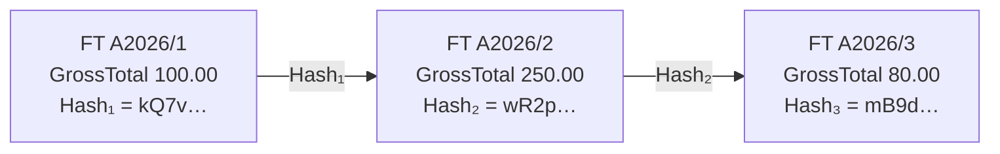
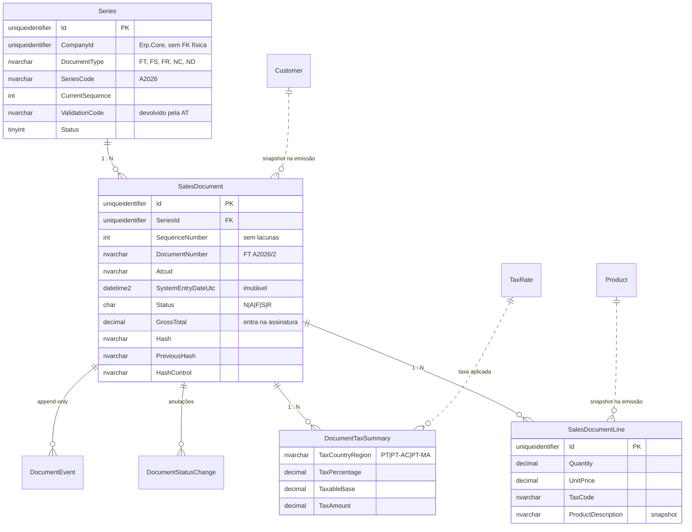

# Certificação AT do Erp.Sales

Plano de implementação da emissão de documentos de venda certificada pela Autoridade Tributária
no microserviço `Erp.Sales`: cadeia de assinatura, séries e ATCUD, código QR, SAF-T (PT) e o
esquema de base de dados que garante a inviolabilidade dos registos.

| | |
|---|---|
| **Âmbito** | `Erp.Sales` + biblioteca fiscal partilhada (`Erp.FiscalPT`) |
| **Ponto de partida** | API sem implementação (só `/health`) |
| **Fases** | 10, da fundação legal ao pedido à AT |
| **Bloqueante crítico** | Numeração e hash sequenciais por série |

---

## Estado da implementação

| Fase | Estado |
|---|---|
| 1 — Estrutura de projetos | **Feito** — `Erp.FiscalPT` + `Erp.Sales.{Domain,Infrastructure,Application,Storage}` |
| 2 — Modelo de dados imutável | **Feito** — entidades, `SalesDbContext`, migration `InitialSales` e [script de permissões](../src/Services/Erp.Sales.Storage/Data/Scripts/harden-sales-permissions.sql) |
| 3 — Motor de assinatura | **Feito** — `DocumentSignatureString`, `RsaDocumentSigner`, `DocumentSigner` e 22 testes |
| 4 — Séries e ATCUD | **Parcial** — modelo, ciclo de vida, gestão no frontend e registo manual do código de validação; falta o cliente SOAP do *SeriesWSService* |
| 5 — Código QR | **Feito** — `QrCodePayloadBuilder` gera a mensagem e `QrCodeImage` renderiza a imagem PNG, impressa no documento |
| 6 — Emissão e API | **Feito** — emissão transacional com lock por série, listagem, detalhe, anulação e ficheiro de artigos |
| 6d — Faturação de guias | **Feito** — faturas emitidas a partir das guias em `/invoices/from-movements`, com faturação parcial e repetida até ao limite do que a guia moveu, e referência em `OrderReferences` no SAF-T |
| 6b — Movimentação de mercadorias | **Parcial** — guias GR/GT/GA/GC/GD emitidas, assinadas e numeradas como as faturas, com locais de carga e descarga, início de transporte e matrícula; o código da AT regista-se manualmente, falta a comunicação prévia por webservice |
| 6c — Recibos | **Feito** — recibos RC/RG emitidos, assinados e numerados como as faturas, com as faturas que liquidam, os meios de pagamento e a anulação que devolve as faturas a dívida |
| 7 — Documento impresso | **Parcial** — impressão em HTML/A4 para faturas, guias e recibos, com todas as menções obrigatórias, cópias e código QR; falta o PDF assinado exigido a partir de 2027 |
| 8 — SAF-T (PT) | **Feito** — ficheiro 1.04_01 gerado em `Erp.FiscalPT/Saft` com header, master files, `SalesInvoices`, `MovementOfGoods` e `Payments`, validado contra o XSD oficial da AT na emissão e nos testes, com página de exportação em `/saft` |
| 9 — Pedido de certificação | **Por fazer** |

Na UI (`Erp.Main`): `/invoices` lista, `/invoices/new` emite e `/invoices/{id}` mostra o documento
com o hash, o ATCUD, a mensagem do QR e a anulação com motivo. As tabelas auxiliares têm páginas
próprias em `/series` e `/products`, e a empresa ativa escolhe-se no cabeçalho.

Ainda não implementado e necessário antes de qualquer utilização real: comunicação automática de
séries à AT, comunicação prévia dos documentos de transporte, idempotência na emissão e validação da
empresa contra o `Erp.Core`.

---

## Onde estamos

> **Nota:** este plano foi escrito quando o Sales era um microserviço próprio. Passou entretanto a
> ser um módulo dentro do host único `Erp.Api`; as camadas e o desenho mantêm-se, muda apenas onde
> vivem os controllers.

O `Erp.Sales.Api` ainda não tinha nada implementado além do endpoint `/health`, mas a intenção já
está semeada no repositório:

- o `.csproj` referencia `QRCoder` e `Microsoft.EntityFrameworkCore.SqlServer`;
- o `appsettings.json` tem a connection string da base e uma secção `AT` com o endpoint do
  *SeriesWSService* e caminho para certificado;
- existe um projeto `Erp.FiscalPT.Tests` vazio à espera da biblioteca que vai testar.

Nada disso está ligado. O plano assume construção de raiz, respeitando a convenção de camadas do
repositório: **Domain** (modelos), **Infrastructure** (interfaces), **Application**
(implementações), **Storage** (EF Core) e **Api** (Controllers, nunca Minimal APIs).

> [!WARNING]
> **Corrigir antes de começar:** o `Erp.Sales.Api/appsettings.json` aponta
> `IdentityServer:Authority` para `https://localhost:7100`, mas o Identity corre em `7081`.
> Enquanto isso não for alinhado, nenhum pedido autenticado ao Sales passa a validação do token.

---

## O mecanismo central

Tudo o que distingue um programa certificado de um CRUD de faturas está numa ideia: cada documento
emitido é assinado com a chave privada do produtor de software, e a assinatura do documento
anterior da mesma série entra no que se assina a seguir. Quebrar, apagar ou reordenar um documento
parte a cadeia, e a AT deteta-o com a chave pública entregue no pedido de certificação.



A string assinada do documento 2 é:

```
2026-01-15;2026-01-15T10:32:04;FT A2026/2;250.00;kQ7v…
   │             │                  │        │      └── hash do documento anterior
   │             │                  │        └───────── total com IVA
   │             │                  └────────────────── nº do documento
   │             └───────────────────────────────────── data-hora de registo
   └─────────────────────────────────────────────────── data do documento
```

A emissão tem de ser serializada por série: duas emissões concorrentes que leiam o mesmo *hash
anterior* produzem uma cadeia partida que nenhuma correção posterior repara.

---

## As dez fases

A ordem importa: as fases 2 e 3 são fundação e tudo o resto assenta nelas. As fases 0 e 9 são
processo com a AT e correm em paralelo com o desenvolvimento.

### Fase 0 — Decisões prévias e enquadramento

*Portaria 363/2010 · DL 28/2019 · sem código*

Antes de escrever uma linha, fechar as decisões que condicionam o modelo de dados e que são caras
de mudar depois.

- **Âmbito documental.** Que tipos de documento o Sales emite na v1 — o mínimo viável é `FT`,
  `FS`, `FR`, `NC` e `ND`. As guias de movimentação (`GR`, `GT`, `GA`, `GC`, `GD`) já estão
  implementadas e exportam-se em `MovementOfGoods`; os recibos (`RC`, `RG`) também, e exportam-se
  em `Payments`. Fora do regime de IVA de caixa o recibo leva `TaxPayable` a zero — o IVA foi
  apurado na fatura — e as suas linhas apontam para os documentos de origem que liquida.
- **Quem é o produtor certificado.** A certificação é atribuída a uma entidade com sede ou
  estabelecimento estável em Portugal, contabilidade organizada e IVA no regime normal. É essa
  entidade que gera o par de chaves e recebe o número de certificado.
- **Multi-empresa e estabelecimentos.** O `Erp.Core` já tem `Company` e `UserCompany`. As séries
  são por empresa e podem ser por estabelecimento — o identificador de série nunca pode repetir-se
  para o mesmo sujeito passivo e o mesmo tipo de documento.
- **Espaços fiscais.** Continente, Açores e Madeira têm taxas distintas e entram separadamente no
  QR e no SAF-T. Decidir já se a v1 suporta os três.
- **Autofaturação e faturação por terceiros**, se aplicável — muda o estado do documento e o SAF-T.

**Critério de aceitação:** documento de âmbito aprovado, com a lista fechada de tipos de documento,
espaços fiscais e a entidade produtora identificada.

### Fase 1 — Estrutura de projetos

*6 projetos novos · convenção do repo*

A lógica fiscal não pertence ao Sales: assinatura, ATCUD, QR e SAF-T vão ser precisos em Compras,
Contabilidade e em qualquer módulo que emita documentos. Extrair para uma biblioteca partilhada
desde o primeiro dia — o `Erp.FiscalPT.Tests` já existe exatamente para isso.

| Projeto | Conteúdo |
|---|---|
| `Erp.FiscalPT` | Assinatura RSA e cadeia de hash, construção do ATCUD, *payload* do QR, escrita e validação do SAF-T. Sem dependências de EF nem de ASP.NET. |
| `Erp.Sales.Domain` | Entidades e enums: `Series`, `SalesDocument`, `SalesDocumentLine`, `DocumentTax`, `CustomerSnapshot`. |
| `Erp.Sales.Infrastructure` | Interfaces: `IDocumentIssuingService`, `ISeriesService`, `IDocumentSigner`, `IAtSeriesClient`, `ISaftExporter`, mais os contratos de storage. |
| `Erp.Sales.Application` | Implementações dos serviços e orquestração da emissão. |
| `Erp.Sales.Storage` | `SalesDbContext`, configurações, migrations e repositórios sobre a connection string `ErpDb`. |
| `Erp.Api` | Controllers do módulo, DI e políticas de autorização — partilhado com os restantes módulos. |

Cada projeto expõe o seu `DependencyInjection.cs` com um extension method (`AddSalesStorage`,
`AddSalesApplication`), como já acontece no Core e no Identity.

**Critério de aceitação:** solução compila com os projetos novos registados no `Erp.slnx`, e o
`Erp.FiscalPT.Tests` passa a referenciar `Erp.FiscalPT`.

### Fase 2 — Modelo de dados imutável

*Portaria 363/2010 · Despacho 8632/2014 · fundação*

O requisito que a AT verifica com mais atenção é a **inviolabilidade**: um documento emitido não
pode ser alterado nem apagado, por nenhuma via — nem pela aplicação, nem por um administrador com
acesso à base de dados. Isto é uma decisão de modelação, não uma regra de negócio que se acrescenta
depois.

Regras a materializar no esquema:

- **Append-only.** Sem `UPDATE` nem `DELETE` em documentos emitidos. Correções fazem-se por
  documento retificativo; anulação regista estado `A` com motivo, utilizador e data-hora, mantendo
  o registo original e o seu lugar na cadeia.
- **Numeração sequencial sem lacunas** por série e tipo de documento, atribuída na emissão e nunca
  reutilizada.
- **Snapshot do cliente e dos artigos** no documento. Alterar a morada de um cliente não pode
  reescrever faturas antigas.
- **Campos fiscais congelados:** `SystemEntryDate`, `Hash`, `HashControl`, `Atcud`,
  `DocumentNumber`, totais e taxas.
- **Rascunhos separados.** Se houver edição antes da emissão, vive numa entidade distinta
  (`DocumentDraft`) que não partilha tabela com o documento emitido.
- **Registo de eventos** imutável: emissão, anulação, tentativas falhadas, exportações SAF-T.

Como impor ao nível técnico:

- EF Core: `DeleteBehavior.Restrict` em todas as relações, sem *cascade delete*; propriedades
  fiscais sem *setter* público.
- Permissões de base de dados: `SELECT` e `INSERT` nas tabelas de documentos, sem `UPDATE` nem
  `DELETE`.
- *Temporal tables* do SQL Server nas tabelas de suporte, para reconstruir o estado de qualquer data.
- `decimal(19,6)` nos valores unitários e `decimal(19,2)` nos totais; arredondamento numa única
  função documentada.
- Datas em `Europe/Lisbon` com `DateTimeOffset` guardado em UTC — o `SystemEntryDate` tem de ser
  monotónico dentro da série.

> [!CAUTION]
> Qualquer funcionalidade de "editar fatura" que sobreviva ao desenho impede a certificação, mesmo
> que nunca seja usada em produção. O programa não pode *ter* a capacidade, não basta não a expor.

O esquema completo está em [Estrutura da base de dados](#estrutura-da-base-de-dados).

**Critério de aceitação:** testes de integração que provam que uma tentativa de alterar ou apagar
um documento emitido falha na base de dados, e que a anulação preserva o registo original.

### Fase 3 — Motor de assinatura

*Portaria 363/2010, art. 6.º · `Erp.FiscalPT` · núcleo*

A string a assinar são cinco campos separados por ponto e vírgula, com formatos rígidos. Um espaço
a mais ou uma vírgula decimal em vez de ponto produz uma assinatura que a AT rejeita.

```
{InvoiceDate};{SystemEntryDate};{InvoiceNo};{GrossTotal};{PreviousHash}

InvoiceDate      yyyy-MM-dd              2026-01-15
SystemEntryDate  yyyy-MM-ddTHH:mm:ss     2026-01-15T10:32:04
InvoiceNo        {Tipo} {Série}/{Nº}     FT A2026/2
GrossTotal       2 decimais, ponto,      250.00
                 sem separador de milhares
PreviousHash     hash do doc. anterior   vazio no 1.º da série
                 da mesma série
```

Algoritmo:

- RSA com digest **SHA-1** e *padding* PKCS#1 v1.5, chave privada de **1024 bits** do produtor.
- Em .NET: `rsa.SignData(bytes, HashAlgorithmName.SHA1, RSASignaturePadding.Pkcs1)`, resultado em
  Base64 (172 caracteres).
- `HashControl` guarda a versão da chave usada — permite rodar a chave sem invalidar o histórico.
- Os 4 caracteres impressos são os das posições **1, 11, 21 e 31** do Base64, separados por hífen.

> [!CAUTION]
> **Concorrência é o risco de engenharia desta fase.** Atribuir número e ler o hash anterior tem de
> ser atómico por série. Com várias instâncias do Sales, a única solução robusta é um *lock*
> pessimista na linha da série dentro da transação de emissão — em SQL Server,
> `SELECT … FROM Series WITH (UPDLOCK, ROWLOCK) WHERE Id = @id` antes de calcular. Contadores em
> memória, `IDENTITY` ou GUIDs não servem: `IDENTITY` deixa lacunas quando uma transação reverte, e
> lacunas na numeração são uma não conformidade.

Gestão da chave privada: nunca no repositório nem em `appsettings`. Em desenvolvimento, *user
secrets*; em produção, Azure Key Vault ou equivalente. A chave pública correspondente é entregue à
AT no pedido de certificação.

**Critério de aceitação:** testes em `Erp.FiscalPT.Tests` que reproduzem os vetores de teste
publicados pela AT, e um teste de concorrência com emissões paralelas na mesma série que não
produz lacunas nem cadeia partida.

### Fase 4 — Séries e ATCUD

*Portaria 195/2020 · webservice AT*

Cada série tem de ser comunicada à AT *antes* de emitir o primeiro documento. A AT devolve um
**código de validação** que, com o número sequencial do documento, forma o ATCUD.

```
ATCUD:{CódigoValidação}-{NúmeroSequencial}

ATCUD:JFTX7RK9-2
```

Integração com o *SeriesWSService*:

- SOAP sobre o endpoint já configurado em `AT:WebserviceUrl`, com autenticação por certificado do
  sujeito passivo e credenciais de subutilizador — mover `CertificatePath` e
  `CertificatePassword` para *secrets*.
- Operações a cobrir: registar série, consultar séries, finalizar série e anular série.
- Validar primeiro no ambiente de testes da AT, com NIF e certificado de teste.
- O código de validação é persistido na `Series`; sem ele, a emissão nessa série é recusada.

Ciclo de vida: **Criada** → **Comunicada** → **Ativa** → **Finalizada** (comunicada à AT, não
aceita mais documentos). A transição para finalizada é irreversível.

**Critério de aceitação:** uma série registada no ambiente de testes da AT devolve código de
validação, fica persistida, e a emissão numa série não comunicada é recusada com erro explícito.

### Fase 5 — Código QR

*Portaria 195/2020 · QRCoder já referenciado*

O *payload* é uma string de pares `Campo:Valor` separados por asterisco. Os campos abaixo são os
estruturais; as bases tributáveis e o IVA repetem-se por espaço fiscal e por taxa, e a
especificação técnica oficial é a referência a seguir campo a campo.

| Campo | Conteúdo | Exemplo |
|---|---|---|
| `A` | NIF do emitente | `123456789` |
| `B` | NIF do adquirente | `999999990` |
| `C` | País do adquirente | `PT` |
| `D` | Tipo de documento | `FT` |
| `E` | Estado do documento | `N` |
| `F` | Data do documento | `20260115` |
| `G` | Identificação única | `FT A2026/2` |
| `H` | ATCUD | `JFTX7RK9-2` |
| `I1…I8` | Espaço fiscal, bases e IVA por taxa | `PT` |
| `N` | Total de impostos | `46.75` |
| `O` | Total do documento | `250.00` |
| `Q` | 4 caracteres do hash | `kR9x` |
| `R` | N.º do certificado do programa | `9999` |

O gerador vive em `Erp.FiscalPT` e produz a string; o `QRCoder` renderiza a imagem. Em documentos
com várias páginas, o código pode constar na primeira ou na última.

**Como está implementado.** O `QrCodeImage` renderiza o PNG com o `PngByteQRCode` do QRCoder — o
renderizador de bytes, não o de *bitmap* — para funcionar igual em Windows, Linux e contentores sem
qualquer biblioteca de desenho. O nível de correção de erro é M, o mínimo que a portaria admite, e
o resultado é determinístico: o mesmo documento imprime sempre o mesmo código. O `RenderDataUri`
devolve-o pronto a entrar num `img`, que é como a página de impressão o consome.

**Critério de aceitação:** QR de um documento de teste lido por uma aplicação de leitura devolve
todos os campos com os valores esperados, incluindo bases e IVA por taxa.

### Fase 6 — Emissão e API

*Controllers · scopes `erp.sales.read` / `erp.sales.write`*

A emissão é uma única transação: bloquear a série, atribuir número, calcular totais e impostos,
montar a string, assinar, gravar documento e linhas, gerar ATCUD e QR. Falhando qualquer passo,
nada é gravado.

| Método | Rota | Autorização |
|---|---|---|
| `POST` | `/api/invoices` | `erp.sales.write` |
| `GET` | `/api/invoices/{id}` | `erp.sales.read` |
| `GET` | `/api/invoices` | `erp.sales.read` |
| `POST` | `/api/invoices/{id}/void` | `erp.sales.write` + role |
| `POST` | `/api/credit-notes` | `erp.sales.write` |
| `GET` | `/api/series` | `erp.sales.read` |
| `POST` | `/api/series/{id}/communicate` | Admin, SuperAdmin |
| `GET` | `/api/saft` | Admin, SuperAdmin |

- **Idempotência obrigatória.** Um *retry* de rede não pode gerar duas faturas: cabeçalho
  `Idempotency-Key` guardado com o resultado da primeira execução.
- **Multi-empresa.** A empresa vem do contexto do utilizador e é validada contra
  `/api/access/me/companies` do Core; a série tem de pertencer a essa empresa.
- Sem endpoint de alteração ou remoção de documentos — nem sequer para administradores.

**Critério de aceitação:** emissão end-to-end autenticada pelo Identity, com documento persistido,
hash encadeado, ATCUD e QR, e um *retry* com a mesma chave de idempotência a devolver o documento
original em vez de um novo.

### Fase 7 — Documento impresso

*Portaria 363/2010 · CIVA art. 36.º*

Menções obrigatórias cuja ausência é, por si só, motivo de não conformidade:

- Os 4 caracteres do hash seguidos de `Processado por programa certificado n.º XXXX/AT`.
- ATCUD e código QR.
- Designação do documento por extenso, série e número sequencial.
- Identificação completa do emitente e do adquirente, com NIF.
- Bases tributáveis e IVA discriminados por taxa, e o motivo de isenção quando aplicável.
- Identificação de cópias: `Original`, `Duplicado`, `Triplicado`.
- Nos documentos retificativos, referência ao documento retificado.

> [!NOTE]
> **Documentos retificativos.** As notas de crédito e de débito identificam o documento que
> corrigem e o motivo, como exige o artigo 36.º n.º 5 do CIVA. A regra é imposta nos dois sentidos
> pelo `SalesDocumentService`: uma `NC` ou `ND` sem referência é recusada, e uma `FT`, `FS` ou `FR`
> com referência também — porque aí não significa nada. O documento corrigido tem de pertencer à
> mesma empresa, não estar anulado e não ser ele próprio retificativo. O número é copiado para o
> documento, como qualquer outro *snapshot*, e vai para o SAF-T em `References/Reference` e
> `Reason` em cada linha. Note-se que **o XSD não obriga**: o `References` é opcional e nenhuma das
> 19 regras `xs:assert` o verifica, pelo que a validação do ficheiro não apanharia a falta.
>
> **Um documento não pode ser creditado além do seu valor.** As notas de crédito já emitidas contra
> ele contam para esse tecto; as anuladas não, porque não creditam nada. As notas de débito não são
> limitadas — acrescentam ao que o cliente deve em vez de retirarem. O `InvoiceDetailDto` devolve o
> `CreditedAmount` para o ecrã mostrar quanto resta antes de se emitir, mas quem impõe a regra é o
> `SalesDocumentService`.
>
> O tecto só é seguro porque a **linha do documento a creditar é bloqueada** com
> `WITH (UPDLOCK, ROWLOCK)` antes de se ler o que já foi creditado. Sem isso, duas notas emitidas ao
> mesmo tempo por séries diferentes liam ambas o valor antigo e passavam as duas. A ordem de
> bloqueio é sempre a mesma — primeiro a série, depois o documento — pelo que não há risco de
> *deadlock* entre emissões concorrentes.

> [!NOTE]
> Faturas em PDF passam a exigir **assinatura eletrónica qualificada** a partir de 1 de janeiro de
> 2027. Se o Sales vai gerar PDF, desenhar já o ponto de extensão para assinar o ficheiro.

**Como está implementado.** Cada família de documento tem a sua página de impressão —
`/invoices/{id}/print`, `/stock-movements/{id}/print` e `/payments/{id}/print` — em HTML dimensionado
para A4, com um `PrintLayout` sem menu nem barra, para o que se vê no ecrã ser o que sai na
impressora. As partes legalmente obrigatórias vivem em componentes partilhados, não copiadas por
página: o `PrintDocumentHeader` (emitente completo, designação por extenso, série e número, cópia) e
o `PrintFiscalFooter` (os 4 caracteres do hash seguidos de *Processado por programa certificado
n.º XXXX/AT*, o ATCUD e o código QR).

Duas decisões que vale a pena registar:

- **O número do certificado é lido do próprio documento**, do campo `R` do QR, e não da configuração
  atual. Se o certificado mudar, um documento emitido antes continua a imprimir o número com que
  foi emitido — que é o que tem de constar.
- **As cópias** — `Original`, `Duplicado`, `Triplicado` — escolhem-se numa barra que só existe no
  ecrã: o `@media print` remove-a, tal como remove os *providers* do MudBlazor.

Os motivos de isenção aparecem uma vez cada, por baixo do resumo de IVA, e um documento anulado sai
com a marca bem visível. Falta o PDF: hoje o utilizador imprime pelo navegador, o que basta para
papel mas não para a fatura eletrónica assinada exigida a partir de 2027.

**Critério de aceitação:** documento de teste impresso com todas as menções, validado contra a
checklist da AT.

### Fase 8 — SAF-T (PT)

*Portaria 302/2016 · versão 1.04_01*

A exportação do SAF-T de faturação na versão **1.04_01**, em vigor desde julho de 2017, é o formato
que a AT usa para auditar. Sem exportação válida não há certificação.

- **Header** com identificação da empresa, período, versão e número do certificado do programa.
- **MasterFiles**: `Customer`, `Product`, `TaxTable`.
- **SourceDocuments/SalesInvoices**: cada documento com `Hash`, `HashControl`, `ATCUD`,
  `SystemEntryDate` e estado.
- **SourceDocuments/MovementOfGoods** e **SourceDocuments/Payments** para guias e recibos.
- Validação automatizada contra o XSD oficial como parte dos testes, não como verificação manual.
- Totais de controlo (`NumberOfEntries`, `TotalDebit`, `TotalCredit`) conferidos contra a base de
  dados.

**Como está implementado.** O gerador vive no [`Erp.FiscalPT/Saft`](../src/Shared/Erp.FiscalPT/Saft/),
que é a biblioteca fiscal partilhada e não sabe nada de EF nem do módulo de vendas: recebe um
`SaftAuditFile` e escreve o XML. O `SaftExportService` do Sales lê os documentos do período e
preenche esse modelo; o `SaftController` junta-lhe a empresa, que pertence ao Core. Três decisões
que valem a pena registar:

- **Os *master files* derivam dos próprios documentos.** Cada documento traz o snapshot do cliente,
  dos artigos e das taxas, por isso `Customer`, `Product` e `TaxTable` são construídos a partir das
  linhas exportadas. O ficheiro fica coerente consigo mesmo mesmo que a ficha de cliente ou de
  artigo tenha mudado entretanto — que é precisamente o que a AT verifica.
- **Os totais de controlo são calculados pelo escritor**, nunca recebidos do chamador: assim não há
  como divergirem do conteúdo. Documentos anulados entram no ficheiro com estado `A`, porque o
  SAF-T tem de dar conta de todos os números emitidos, mas ficam fora dos totais.
- **A morada da empresa passou a ser obrigatória** no `Erp.Core`: o `CompanyAddress` do Header
  exige-a, e sem ela o ficheiro não valida.

**Validação contra o esquema oficial.** O
[`SAFTPT1.04_01.xsd`](../src/Shared/Erp.FiscalPT/Saft/Schemas/SAFTPT1.04_01.xsd) publicado pela AT
está no repositório e vai embebido no assembly, para a validação nunca depender da rede. O
`SaftSchemaValidator` valida contra ele, e a exportação valida sempre antes de entregar o ficheiro:
os erros vão para o log do servidor e a contagem viaja no cabeçalho `X-Saft-Validation-Errors`, que
a página mostra ao utilizador.

Duas limitações que convém ter presentes, porque o esquema publicado é XSD 1.1 e o .NET só
implementa 1.0:

- As **19 regras `xs:assert`** são descartadas ao carregar o esquema (`SkippedAssertions` expõe a
  contagem, e há um teste que a fixa para que uma atualização do esquema não passe despercebida).
  São regras de co-ocorrência — por exemplo, exigir motivo de isenção quando o imposto é zero.
- O único `xs:all` do esquema, dentro de `GeneralLedgerEntries`, é convertido em `xs:sequence`.
  Só acrescenta uma restrição de ordem, e está numa parte que o ficheiro de faturação não contém.

Passar aqui é, portanto, necessário mas não suficiente: o validador da AT continua a ser a última
palavra. Ainda assim já apanhou dois defeitos reais — um `TaxTable` vazio, que o esquema recusa, e
a unicidade de `InvoiceNo` dentro do ficheiro.

O SAF-T de contabilidade é obrigação distinta e posterior — aplica-se a períodos a partir de 2027,
com submissão em 2028.

**Critério de aceitação:** ficheiro exportado de um mês de emissões passa a validação XSD e os
totais de controlo batem certo com a base de dados.

### Fase 9 — Pedido de certificação

*Portaria 363/2010, art. 3.º · processo AT*

Com o software a cumprir os requisitos, o pedido faz-se eletronicamente no Portal das Finanças.

- Entrega da **chave pública** correspondente à chave de assinatura.
- Declaração de que o programa cumpre os requisitos e não tem funcionalidades que permitam alterar
  registos.
- Identificação da versão do programa — alterações relevantes obrigam a comunicar nova versão.
- Atribuição do número de certificado, que passa a ser impresso em todos os documentos e a constar
  do SAF-T.

> [!NOTE]
> Os requisitos formais e a documentação exigida mudam com alguma frequência. Confirmar o
> formulário e a checklist em vigor no Portal das Finanças antes de submeter.

**Critério de aceitação:** número de certificado atribuído e configurado na aplicação, a aparecer
nos documentos e no SAF-T.

---

## Estrutura da base de dados

Tabelas do módulo Sales, hoje em `dbo` na base única `ErpPortugal`. O desenho responde a três exigências em simultâneo:
alimentar a string assinada sem perder precisão, impedir alteração de documentos emitidos, e
produzir o SAF-T sem reconstruir dados que já não existem.



O documento carrega cópias dos dados do cliente e dos artigos no momento da emissão, em vez de os
referenciar por chave estrangeira: alterar uma morada anos depois não pode reescrever o que já foi
faturado. `CompanyId` aponta para o Core **sem chave estrangeira física**, porque vive noutra base
de dados.

### Catálogo de tabelas

| Tabela | Função | Escrita |
|---|---|---|
| `Series` | Séries por empresa e tipo de documento, com o código de validação da AT e o contador sequencial | INSERT + UPDATE do contador |
| `SalesDocument` | Cabeçalho do documento emitido, campos fiscais e snapshot do adquirente | INSERT apenas |
| `SalesDocumentLine` | Linhas com snapshot do artigo, taxa e motivo de isenção | INSERT apenas |
| `DocumentTaxSummary` | Totais de base tributável e IVA por espaço fiscal e taxa | INSERT apenas |
| `DocumentStatusChange` | Anulações: motivo, utilizador e data-hora, sem tocar no documento | INSERT apenas |
| `StockMovement` | Cabeçalho da guia de movimentação, com locais de carga e descarga e dados do transporte | INSERT + UPDATE do código da AT |
| `StockMovementLine` | Mercadoria transportada, com snapshot do artigo e da taxa | INSERT apenas |
| `MovementStatusChange` | Anulações de guias, sem tocar no documento | INSERT apenas |
| `Payment` | Cabeçalho do recibo: numeração, assinatura, cliente e total recebido | INSERT apenas |
| `PaymentLine` | Faturas liquidadas pelo recibo, com número e data copiados e o valor aplicado | INSERT apenas |
| `PaymentMethod` | Meios de pagamento do recibo (`NU`, `CH`, `TB`, ...), que têm de somar o total | INSERT apenas |
| `PaymentStatusChange` | Anulações de recibos; as faturas voltam a ficar em dívida | INSERT apenas |
| `DocumentDraft` | Rascunhos antes da emissão, em tabela separada e sem valor fiscal | livre |
| `Customer` | Master file de clientes para o SAF-T | temporal |
| `Product` | Master file de artigos e serviços | temporal |
| `TaxRate` | `TaxTable` do SAF-T: taxas por espaço fiscal, com validade | temporal |
| `DocumentEvent` | Registo imutável de emissões, anulações, falhas e exportações | INSERT apenas |
| `IdempotencyRecord` | Chave do pedido → documento emitido, para *retries* seguros | INSERT apenas |
| `SaftExport` | Histórico de exportações com período, totais de controlo e hash do ficheiro | INSERT apenas |

### As duas tabelas que carregam a certificação

```sql
Series
  Id                  uniqueidentifier  PK
  CompanyId           uniqueidentifier  -- Erp.Core, sem FK física
  EstablishmentCode   nvarchar(20)      NULL
  DocumentType        nvarchar(4)       -- FT, FS, FR, NC, ND, GR, GT, GA, GC, GD, RC, RG
  SeriesCode          nvarchar(35)      -- A2026
  InitialSequence     int               DEFAULT 1
  CurrentSequence     int               DEFAULT 0
  ValidationCode      nvarchar(16)      NULL  -- devolvido pela AT
  CommunicatedAtUtc   datetime2(0)      NULL
  Status              tinyint           -- Criada|Comunicada|Ativa|Finalizada
  FinalizedAtUtc      datetime2(0)      NULL
  RowVersion          rowversion

  UQ (CompanyId, DocumentType, SeriesCode)

SalesDocument
  Id                  uniqueidentifier  PK
  CompanyId           uniqueidentifier
  SeriesId            uniqueidentifier  FK -> Series (Restrict)
  DocumentType        nvarchar(4)
  SequenceNumber      int               -- sequencial, sem lacunas
  DocumentNumber      nvarchar(60)      -- FT A2026/2  (InvoiceNo do SAF-T)
  Atcud               nvarchar(50)
  DocumentDate        date
  SystemEntryDateUtc  datetime2(0)      -- data-hora de registo, imutável
  Status              char(1)           -- N|A|F|S|R
  SourceBilling       char(1)           -- P|I|M
  CustomerTaxId       nvarchar(30)      -- snapshot
  CustomerName        nvarchar(200)     -- snapshot
  CustomerAddress     nvarchar(400)     -- snapshot
  CustomerCountry     nvarchar(2)
  NetTotal            decimal(19,2)
  TaxPayable          decimal(19,2)
  GrossTotal          decimal(19,2)     -- entra na string assinada
  Hash                nvarchar(200)     -- Base64, 172 caracteres
  PreviousHash        nvarchar(200)     NULL  -- vazio no 1.º da série
  HashControl         nvarchar(70)      -- versão da chave privada
  QrCodePayload       nvarchar(max)
  RectifiedDocumentId uniqueidentifier  NULL  FK -> SalesDocument
  CreatedByUserId     nvarchar(450)

  UQ (SeriesId, SequenceNumber)
  UQ (CompanyId, DocumentNumber)
  IX (CompanyId, DocumentDate)          -- exportação SAF-T por período
```

### Onde as regras legais viram restrições

| Exigência | Mecanismo no esquema |
|---|---|
| Numeração sem lacunas nem repetições | `UNIQUE (SeriesId, SequenceNumber)` e atribuição dentro da transação, sob *lock* da linha da série |
| Documento não alterável | Permissões: `GRANT SELECT, INSERT` e `DENY UPDATE, DELETE` ao utilizador aplicacional nas tabelas de documentos |
| Documento não apagável | `DeleteBehavior.Restrict` em todas as relações; sem *cascade delete* em nenhuma migration |
| Anulação preserva o original | Estado em `DocumentStatusChange`, nunca por `UPDATE` ao cabeçalho |
| Cadeia de assinatura verificável | `PreviousHash` persistido, mais um *job* que revalida a cadeia inteira por série |
| Histórico reconstituível | *Temporal tables* nos master files e snapshot dos dados no próprio documento |
| Precisão de valores | `decimal(19,6)` em quantidades e preços unitários, `decimal(19,2)` em totais |

> [!CAUTION]
> **O `DENY UPDATE, DELETE` não é opcional.** É o que transforma "a aplicação não permite alterar"
> em "a base de dados não deixa alterar" — a diferença entre uma intenção e uma garantia auditável.
> Implica que o `CurrentSequence` da `Series` viva numa tabela com permissões próprias, já que essa
> precisa de `UPDATE`.

---

## Riscos que costumam falhar tarde

| Risco | Onde aparece | Mitigação |
|---|---|---|
| Cadeia partida por concorrência | Duas emissões simultâneas na mesma série | *Lock* pessimista na série dentro da transação; teste de carga com emissões paralelas |
| Lacunas na numeração | `IDENTITY` ou contador incrementado fora da transação | Número atribuído dentro da mesma transação que grava o documento |
| Assinatura inválida por formatação | Vírgula decimal, cultura do servidor, data com *timezone* | `CultureInfo.InvariantCulture` em toda a formatação; vetores de teste da AT no CI |
| Chave privada exposta | Ficheiro no repositório ou em `appsettings` | Cofre de segredos; rotação suportada via `HashControl` |
| Migration destrutiva | EF a recriar tabelas de documentos | Revisão manual de todas as migrations do Sales; sem `EnsureDeleted` em qualquer ambiente |
| Relógio do servidor | `SystemEntryDate` não monotónico | NTP obrigatório; validação de que a data-hora não recua dentro da série |

---

## Por onde começar

Sequência com melhor retorno: **fase 1** (estrutura) → **fase 3** (assinatura, isolada e testável
sem base de dados) → **fase 2** (modelo) → **fase 6** (emissão de um único tipo de documento, `FT`)
→ **fase 4** (séries reais) → **5**, **7** e **8**.

A fase 3 antes da 2 é deliberada: a assinatura é pura, cabe inteira em `Erp.FiscalPT` e valida-se
contra os vetores da AT sem infraestrutura nenhuma. Ter esse núcleo correto e testado antes de
desenhar tabelas evita descobrir tarde que o modelo não consegue alimentar a string assinada.

---

## Base legal

- [Portaria n.º 195/2020](https://info.portaldasfinancas.gov.pt/pt/destaques/Paginas/Portaria_195_2020.aspx) — código QR e ATCUD, com as especificações técnicas do QR
- [Portaria n.º 363/2010](https://dre.tretas.org/dre/276233/portaria-363-2010-de-23-de-junho) — requisitos dos programas de faturação certificados
- [Despacho n.º 8632/2014](https://info.portaldasfinancas.gov.pt/pt/informacao_fiscal/legislacao/diplomas_legislativos/Documents/Despacho_n%C2%BA_8632_2014_03_07.pdf) — requisitos técnicos, assinatura e os 4 caracteres do hash
- [SAF-T (PT) — questões técnicas](https://info.portaldasfinancas.gov.pt/pt/apoio_contribuinte/questoes_frequentes/Pages/faqs-00276.aspx) — versão 1.04_01 e regras de comunicação
- [Pedir certificação de programa de faturação](https://www.gov.pt/servicos/programa-de-faturacao-certificacao) — procedimento e requisitos do pedido

> Os campos exatos do QR (`I1`–`I8`, `J`, `K`, `L`, `M`, `P`, `S`) e os requisitos formais do pedido
> devem ser validados contra a especificação técnica oficial da Portaria 195/2020 e o Portal das
> Finanças antes da implementação.
